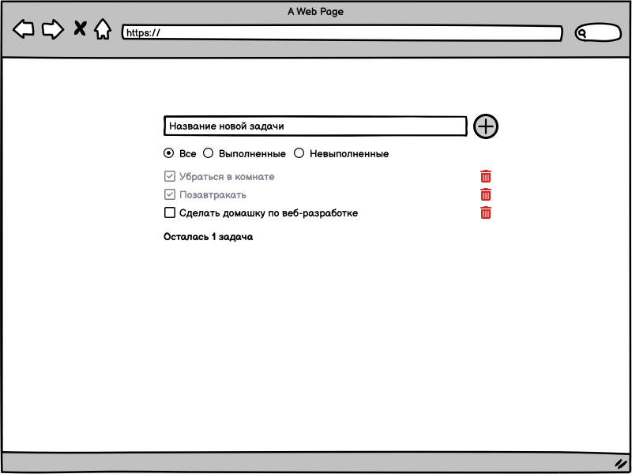

# 10 класс. Домашнее задание №1

Нужно разработать простой список дел/задач по макету:

  

## Пользовательские сценарии

### Обязательные

- При нажатии на кнопку "+" добавляется новое дело с введённым названием
  - После добавления задачи поле ввода очищается
  - Если поле ввода название пустое, то кнопка должна быть заблокирована
- При нажатии на чекбокс (`<input type="checkbox" />`) переклается статус выполнения задачи
  - Выполненная задача должна визуально отличаться от невыполненной, например текст должен становиться тусклее
- При нажатии на кнопку удаления (иконка мусорного ведра) задача удаляется
- Под списком дел должен отображаться текст c количеством оставшихся задач

### Дополнительные

- Должна быть доступна фильтрация задач при помощи радиокнопок (`<input type="radio" />`)

## Критерии оценивания

- **Оценка 2** - если задание не выполнено
- **Оценка 4** - если выполнены все обязательные условия
- **Оценка 5** - если выполнены все обязательные и дополнительные условия

## Отчёт о выполнении

Сдаётся `.zip` архив с кодом решения и коротким видео-обзором программы

> **Дедлайн** - 04.10.2025 23:59
