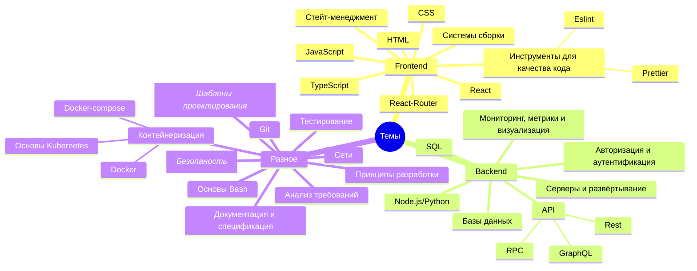

# Курс по веб-разработке

<h2 class="color-gray-400 fw-200">Вводное занятие</h2>

---
src: ./11-1.md#2
---

---

# Цели курса

- Сделать из вас лучших будущих специалистов
- Понемногу подготовить к ВУЗу
- Дать практический опыт разработки
- **Подготовить к олимпиаде [PROD](https://prodcontest.ru/)**
- **Дать необходимый минимум для написания ИВР**

---

# Темы курса

Из чего состоит современный веб



---
src: ./11-1.md#5
---

---
layout: cover
---

# Основы веб-технологий

---
layout: iframe-right
url: html/basic-page.html
transition: none
---

# HTML

> HTML (**HyperText Markup Language, язык гипертекстовой разметки текста**) - стандартизированный язык гипертекстовой разметки документов для просмотра веб-страниц в браузер. Является "базовым" строительным блоком всей всемирной паутины (WWW), определяет содержимое страниц.

<br />

> **Гипертекст** - система из текстовых страниц, ссылающихся друг на друга

---

# HTML

Из чего состоят элементы

> HTML состоит из <span v-mark.yellow="1">тэгов</span>, представляющих различные элементы страницы, которые в свою очередь могут иметь различные <span v-mark.yellow="2">атрибуты</span>

<div class="mt-4">

```html {hide|1,5|2|3|4|all}{at:3}
<div class="some-class">
  Контент
  <a src="ya.ru">Вложенная ссылка</a>
  
</div>
```

</div>

---

<style scoped>
  li {
    font-size: 14px;
  }
</style>

# HTML

Структура документа

- `<!DOCTYPE html>` - доктайп. Является историческим артефактом, должен был быть ссылкой на набор правил
- `<html>` - корневой элемент-контейнер для всей страницы
- `<head>` - метаданные страницы, то есть всё то, что не является контентом, но даёт понять о том, что находится на странице. Например:
  - `<title>` - заголовок страницы
  - `<meta charset="UTF-8" />` - кодировка страницы
  - `<meta name="description" content="Краткое описание страницы">`
  - `<meta name="keywords" content="ключевое слово 1, ключевое слово 2, ключевое слово 3"`
  - `<link>` — подключение внешних ресурсов, например таблиц стилей или иконок.
  - `<script>` — ссылки на внешние файлы JavaScript или встроенные скрипты, которые должны загрузиться раньше контента.
  - `<style>` — позволяет встраивать внутренние CSS непосредственно внутри документа.
  
- `<body>` - контейнер для всего содержимого страницы

---

# HTML

<style scoped>
  td {
    font-size: 12px;
  }
</style>

Основные тэги

<div class="table-dense">

| Тег | Описание | Пример |
|-----|----------|--------|
| `<!DOCTYPE>` | Определяет тип документа и версию HTML | `<!DOCTYPE html>` |
| `<html>` | Корневой элемент HTML-документа | `<html lang="ru">` |
| `<head>` | Содержит метаинформацию о документе | `<head><title>Заголовок</title></head>` |
| `<title>` | Задает заголовок документа (отображается во вкладке браузера) | `<title>Мой сайт</title>` |
| `<body>` | Содержит видимое содержимое страницы | `<body><h1>Заголовок</h1></body>` |
| `<h1>` - `<h6>` | Заголовки различных уровней | `<h1>Главный заголовок</h1>` |
| `<p>` | Параграф/абзац текста | `<p>Это абзац текста.</p>` |
| `<br>` | Перенос строки (одиночный тег) | `Текст<br>на новой строке` |
| `<hr>` | Горизонтальная линия (одиночный тег) | `<hr>` |
| `<!-- -->` | Комментарий (не отображается на странице) | `<!-- Это комментарий -->` |
| `<a>` | Ссылка/гиперссылка | `<a href="https://example.com">Ссылка</a>` |
| `` | Изображение (одиночный тег) | `` |

</div>

---

# HTML

<style scoped>
  td {
    font-size: 12px;
  }
</style>


Основные тэги

<div class="table-dense">

| Тег | Описание | Пример |
|-----|----------|--------|
| `<ul>` | Ненумерованный (маркированный) список | `<ul><li>Пункт 1</li></ul>` |
| `<ol>` | Нумерованный список | `<ol><li>Первый пункт</li></ol>` |
| `<li>` | Элемент списка | `<li>Элемент списка</li>` |
| `<table>` | Таблица | `<table><tr><td>Ячейка</td></tr></table>` |
| `<tr>` | Строка таблицы | `<tr><td>Ячейка 1</td></tr>` |
| `<td>` | Ячейка таблицы с данными | `<td>Данные</td>` |
| `<th>` | Заголовочная ячейка таблицы | `<th>Заголовок</th>` |
| `<div>` | Блочный контейнер | `<div>Блок содержимого</div>` |
| `<span>` | Строчный контейнер | `<span>Часть текста</span>` |
| `<strong>` | Важный текст (обычно жирный) | `<strong>Важно!</strong>` |
| `<em>` | Выделенный текст (обычно курсив) | `<em>Выделенный текст</em>` |
| `<b>` | Жирный текст | `<b>Жирный текст</b>` |
| `<i>` | Курсив | `<i>Курсивный текст</i>` |

</div>

---
layout: iframe-right
url: html/semantic-page.html
---

<style scoped>
  th {
    font-size: 13px;
  }

  td {
    font-size: 11px;
  }

  iframe {
    max-height: 100%;
  }

  blockquote {
    font-size: 11px;
  }
</style>

# HTML
Семантические тэги и вёрстка

<div class="table-dense">


| Тег | Описание |
|-----|----------|
| `<header>` | Заголовочный блок страницы или раздела (шапка) | 
| `<footer>` | Нижний колонтитул страницы или раздела (подвал) |
| `<nav>` | Навигационное меню |
| `<main>` | Основное содержание страницы (уникальное) |
| `<article>` | Независимый самодостаточный контент |
| `<section>` | Тематическая группа контента | `<section><h2>Раздел о продукте</h2></section>` |
| `<aside>` | Боковая панель, дополнительный контент |
| `<details>` | Виджет раскрытия/скрытия дополнительной информации |
| `<summary>` | Заголовок для элемента `<details>` |
| `<address>` | Контактная информация автора/владельца |
| `<blockquote>` | Блочная цитата |

</div>

---

<style scoped>
    .box {
      background-color: #fff;
      color: #000;
      padding: 2px;
    }
</style>

# HTML

Поток документа

> **Поток документа** - это принцип организации элементов на странице при отсутствии стилей: если мы напишем HTML и не напишем CSS, то отображение в браузере будет предсказуемо благодаря тому, что мы абсолютно точно знаем, как браузер располагает элементы в потоке

<div class="grid grid-cols-3 mt-4 gap-4">
  <div class="p-4 bg-gray-800 border-rd-4">
    <h4>Блочные элементы</h4>
    <p class='box'>Какой-то очень-очень длинный текст</p>
    <p class='box'>Какой-то очень-очень длинный текст</p>
    <p class='box'>Какой-то очень-очень длинный текст</p>
  </div>

  <div class="p-4 bg-gray-800 border-rd-4">
    <h4>Строчные элементы</h4>
    <p class='box'>Какой-то очень-очень длинный текст, а тут <a>ссылка</a>, а тут <i>курсив</i>, а тут <b>жирный</b></p>
    <span class="box">Короткий текст</span>
  </div>

  <div class="p-4 bg-gray-800 border-rd-4">
    <h4>Строчно-блочные</h4>
    <div class="box mt-4 font-size-4"><button class="bg-gray-400 border-rd-2 h-10">Кнопка</button> <input class="h-12" placeholder="поле ввода" style="width: 110px" /> и текст
    </div>
  </div>
</div>

---

# CSS

> **CSS ( Cascading Style Sheets, "Каскадные таблицы стилей")** - язык для описания внешнего вида документа

<div class="my-4">

```css
/* комментарий к CSS-правилу */
селектор {
  свойство: значение;

  & вложенный-селектор {
    свойство: значение;
  }
}
```

</div>

- `font-family`, `font-size`, `font-weight`, `font-style` — свойства шрифта
- `color`, `background-color`, `border-color` — свойства цвета
- `text-align`, `text-decoration`, `text-transform` — свойства текста
- `display`, `float`, `position`, `margin`, `padding` — свойства макета
- `background-image`, `background-repeat`, `background-position` — свойства фона

---

# CSS

Блочная модель

> **Блочная модель (box model)** - алгоритм расчёта браузером размера каждого элемента на странице.


Изначально в расчёт размера элемента входят его внутренние отступы и рамки, но при помощи css-свойства `box-sizing: border-box` можно их исключить (значение по умолчанию - `content-box`)

---

<style scoped>
  p:not(h1 + p) {
    font-size: 10px;
    margin: 5px 0;
    line-height: 1rem;
  }

  li {
    font-size: 10px;
  }

  h5 {
    font-size: 12px;
    font-weight: 600;
  }
</style>

# CSS

Виды селекторов

<div class="grid grid-cols-3 gap-4">

  <div class="bg-gray-800 p-2 border-rd-4">
    <h5>Универсальный селектор</h5>
    <p>Соответствует абсолютно любому тэгу</p>
```css
* {
  font-size: 0
}
```
  </div>

  <div class="bg-gray-800 p-2 border-rd-4">
    <h5>Селектор по тэгу</h5>
    <p>Соответствует всем элементам с указанным тэгом</p>
```css
p {
  color: #eee;
}
```
  </div>

  <div class="bg-gray-800 p-2 border-rd-4">
    <h5>Селектор по классу</h5>
    <p>Соответствует всем элементам с указанным классом</p>
```css
.some-class {
  border: 1px solid #000;
}
```

  <p>Класс задаётся html-атрибутом <code>class</code></p>
  </div>
  
  <div class="bg-gray-800 p-2 border-rd-4">
    <h5>Селектор по идентификатору (id)</h5>
    <p>Соответствует всем элементам с указанным идентификатором</p>
```css
#some-id {
  border-radius: 4px;
}
```
    <p>Id задаётся html-атрибутом <code>id</code></p>
  </div>

  <div class="bg-gray-800 p-2 border-rd-4 grid-col-span-2 grid grid-cols-2 gap-2">
    <div>
      <h5>Селектор по атрибуту</h5>
      <p>Соответствует элементам с наличием атрибута или определённым значением</p>
```css
button[disabled] {
  background-color: #555;
}
a[href="#"] {
  text-decoration: line-through;
}
```
  </div>

  <div>

  - `[attr]` - наличие
  - `[attr~="value"]` - одно из слов значения (которое состоит из слов, разделённых пробелом) равно `value`
  - `[attr^=value]` - значение начинается с `value`
  - `[attr$=value]` - значение заканчивается на `value`
  - `[attr*=value]` - значение содержит подстроку `value`
  - `[attr*="value" i]` - с `i` игнорируется регистр

  </div>
  </div>

</div>

---

<style scoped>
  li {
    font-size: 12px;
  }
</style>

# CSS

Специфичность селекторов

> **Специфичность** - один из ключевых факторов, который определяет приоритет для применения CSS-правила к элементу в случае, если ему соответствует несколько селекторов, содержащих одинаковое свойство

<div class="grid grid-cols-2 gap-4 mt-8">
<div>

#### Приоритет селекторов

1. Селекторы по **идентификатору**
2. Селекторы по **классу**, **атрибуту** и селекторы **с псевдоклассами**
3. Селекторы по **тегу**, селекторы **с псевдоэлементами**

<div class="mt-4">

<div class="mb-4">

> Можно проссумировать все селекторы в комбинации по их приоритету и сравнить самые высокие разряды, чтобы понять, какой селектор специфичнее

</div>

> Приоритет селекторов можно нарушить при помощи ключевого слова `!important`, например: `font-size: 20px !important;`, но **лучше так не делать**

</div>

</div>

<div class="table-dense">
<table> <thead> <tr> <th>Селектор</th> <th>Вес</th> </tr> </thead> <tbody> <tr> <td><code class="inline-code code-fix font-theme font-theme--code">#block section &gt; <wbr>.<wbr>list a</code></td> <td>1.1.2</td> </tr> <tr> <td><code class="inline-code code-fix font-theme font-theme--code">div<wbr>#<wbr>some</code></td> <td>1.0.1</td> </tr> <tr> <td><code class="inline-code code-fix font-theme font-theme--code">#some</code></td> <td>1.0.0</td> </tr> <tr> <td><code class="inline-code code-fix font-theme font-theme--code">* <wbr>.<wbr>list a</code></td> <td>0.1.1</td> </tr> <tr> <td><code class="inline-code code-fix font-theme font-theme--code">.class</code></td> <td>0.1.0</td> </tr> <tr> <td><code class="inline-code code-fix font-theme font-theme--code">section h1</code></td> <td>0.0.2</td> </tr> <tr> <td><code class="inline-code code-fix font-theme font-theme--code">section</code></td> <td>0.0.1</td> </tr> </tbody> </table>
</div>

</div>

---

# CSS

Каскадность

> **Каскадирование** - это механизм, который определяет порядок, в котором браузер применяет стили к элементам на веб-странице в случае возникновения конфликтов

При расчёте CSS-свойств элементов учитываются следующие факторы:
- **Источник правил** - откуда взялся стиль. Источники по приоритету (от высокого к низкому):
  - **Встроенные стили** - имеют наивысший приоритет, их можно перезаписать только при помощи `!important`
  - **Внутренние таблицы стилей** - тег `<style>` в html
  - **Внешние таблицы стилей** - css файлы, загруженные при помощи тега `<link>
  - **Стандартные стили браузера**
- **Специфичность** 
- **Порядок объявления** - правила, объявленные позже, имеют больший приоритет

---

# CSS

<style scoped>
  li, p {
    font-size: 16px;
  }
</style>

Наследование

> **Наследование** - повторение стилей (CSS-свойств) элементов-предков их потомками

Некоторые CSS-свойства, если не указаны для элемента явно, будут переданы ему от первого предка с указанным значением:

- Свойства шрифта (`font` и его «производных): `font-style`, `font-variant`, `font-weight`, `font-stretch`, `font-size` и `font-family`; `color` и `line-height`.
- Свойства межбуквенных и «межсловных» расстояний: `letter-spacing`, `word-spacing` и `white-space`.
- Параметры текста: `text-align`, `text-indent`, `text-shadow`, `text-transform`
- Оформление пунктов списков: `list-style`, `list-style-type`, `list-style-position`.
- Внешний вид курсора - `cursor`
- Видимость элемента - `visibility`

Также можно явно унаследовать значение свойства при помощи ключевого слова `inherit`


---

# JavaScript

> **JavaScript** - язык программирования, разработанный в 1995 году и изначально предназначавшийся для добавления интерактивности на веб-сайты

<h3 class="mt-8 mb-2">Характеристики</h3>

- Мультипарадигменный
- Динамически типизируемый
- Слабо типизируемый
- Интерпретируемый

---
layout: cover
---

# Практика


---
src: ./_shared.md#1
---

---

# Дополнительные материалы

## HTML

- [Doka - Что такое семантика?](https://doka.guide/html/semantics/)

## CSS

- [CSS Diner - интерактивный учебник по CSS-селекторам](https://flukeout.github.io/)
- [HTML Academy - Как работает каскад в CSS](https://htmlacademy.ru/blog/css/cascade-works)

## JS

- [learn.javascript.ru - Современный учебник JavaScript](https://learn.javascript.ru/)