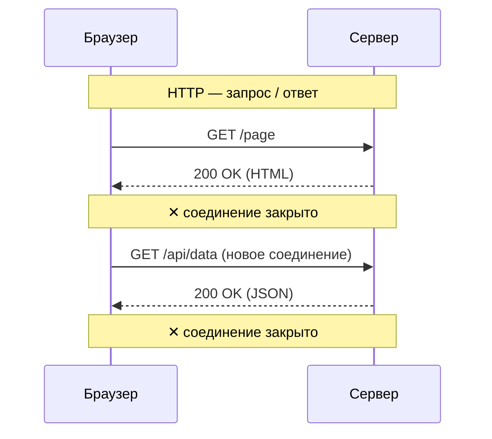
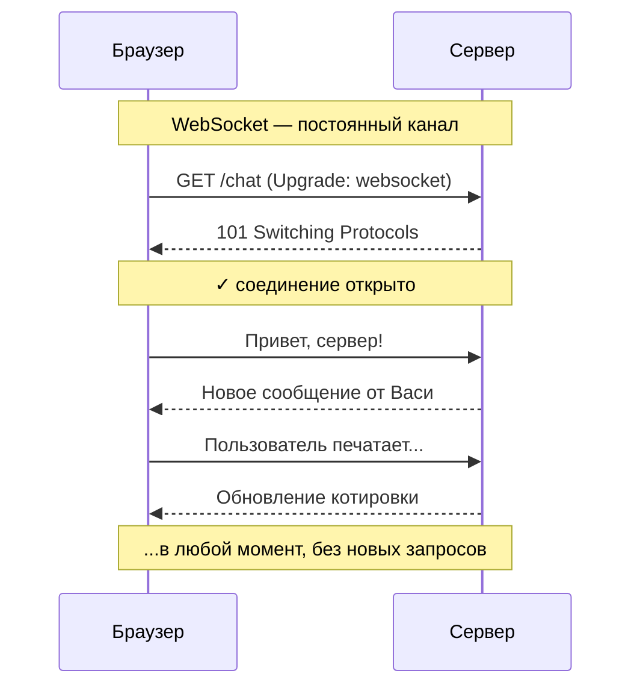

# Курс по веб-разработке

<h2 class="color-gray-400 fw-200">Данные в реальном времени, <code>WebSocket</code><br/>CI/CD</h2>

---
class: table-dense
---

# Данные в реальном времени

<div></div>

Представьте, что вы открываете чат с другом в браузере.

Вы ждёте его сообщения. Как браузер узнает, что оно пришло?

**Вариант А**

Периодически отправлять запросы на сервер, надеясь что сообщение пришло

**Вариант Б**

Установить постоянное соединение с сервером, чтобы он сам оповестил клиента о новом сообщении

<hr />

*Вариант А*: **polling**, он медленный и расточительный и плохо подходит для ситуаций, когда данные обновляются часто

*Вариант Б*: **WebSocket**. Именно благодаря ним работают чаты, многопользовательские игры и биржи

---

<style scoped>
  td {
    font-size: 12px;
  }
</style>

# Данные в реальном времени: подходы

<div class="table-dense">

| Метод | Суть | Преимущества | Недостатки |
|---|---|---|---|
| Short Polling (или просто Polling) | Периодическая отправка запросов на сервер с определённым интервалом | Очень прост в реализации<br/>Универсален | Постоянная нагрузка на сервер<br/>Высокая задержка<br/>Бесполезные запросы<br/>Постоянная переотправка всех данных (заголовков и пр.)  |
| Long Polling | Установка HTTP-соедиение до тех пор, пока не вернётся ответ | Простая реализация | Отправка всех данных с каждым запросом<br/>Большая нагрузка при большом количестве соединений<br/>Большая задержка |
| Server-sent events (SSE) | Отправка потока событий сервером на клиент, реализуется при помощи интерфейса `EventSource`  | Автоматическое восстановление соединений<br/>Простая реализация | Односторонняя связь<br/>Отсутствие поддержки старыми браузерами |
| Веб-сокеты | Специальная технология для установки двустороннего (дуплексного) соединения | Маленькая задержка<br/>Гибкость<br/>Полноценная двусторонняя связь | Ресурсоёмкость<br/>Сложность реализации<br/>Нет поддержки HTTP2<br/>Сложность с балансировкой нагрузки |

</div>

---

# Что такое WebSocket?

<div></div>

**WebSocket** — это протокол двусторонней связи между клиентом и сервером поверх одного постоянного соединения

- **Двусторонняя связь** — и клиент, и сервер могут отправлять сообщения в любой момент
- **Постоянное соединение** — открывается один раз и живёт, пока не закроют

### Где используется

<div clas="table-dense">

| Приложение | Что передаётся |
|---|---|
| Чаты (Telegram Web, Slack) | Сообщения в реальном времени |
| Браузерные игры | Позиции и действия игроков |
| Биржи и трейдинг | Котировки каждую секунду |
| Коллаборативные системы (Google Docs и подобные) | Изменения от других пользователей |
| Уведомления | Нотификации без перезагрузки страницы |

</div>

---

# Что такое WebSocket?

<div></div>

WebSocket — это **отдельный протокол** со своей схемой адреса:

```
http://example.com   →  обычный HTTP
https://example.com  →  защищённый HTTP

ws://example.com     →  WebSocket
wss://example.com    →  защищённый WebSocket (поверх TLS)
```

### Стандарт:
- Описан в **RFC 6455** (2011 год)
- Поддерживается всеми современными браузерами
- Работает поверх протокола TCP, как и HTTP

> `wss` — это как `https` по сравнению с `http` , только для WebSocket. В продакшне всегда должен использоваться только он

---

# WebSocket

Установка соеднинения

WebSocket-соединение начинается с обычного HTTP-запроса — это называется **рукопожатие (handshake)**.

<div class="grid grid-cols-2 gap-4">

<div>

**Клиент отправляет:**
```http
GET /chat HTTP/1.1
Host: example.com
Upgrade: websocket
Connection: Upgrade
Sec-WebSocket-Key: dGhlIHNhbXBsZSBub25jZQ==
Sec-WebSocket-Version: 13
```

</div>
<div>

**Сервер отвечает:**
```http
HTTP/1.1 101 Switching Protocols
Upgrade: websocket
Connection: Upgrade
Sec-WebSocket-Accept: s3pPLMBiTxaQ9kYGzzhZRbK+xOo=
```

</div>

</div>

Статус **101 Switching Protocols** означает, что можно переключиться на WebSocket, после чего обычный HTTP больше не используется

---

# WebSocket vs HTTP

<div class="grid grid-cols-2 gap-4">





</div>

---

# HTTP vs WebSocket

| Характеристика | HTTP | WebSocket |
|---|---|---|
| **Модель** | Запрос → Ответ | Двусторонний канал |
| **Инициатор** | Только клиент | Клиент или сервер |
| **Соединение** | Открывается на каждый запрос | Открывается один раз |
| **Накладные расходы** | Заголовки в каждом запросе | Только при открытии |
| **Задержка** | Выше | Минимальная |
| **Кэширование** | Есть | Нет |
| **Применение** | Статика, API, файлы | Реальное время |

> HTTP и WebSocket не конкуренты - они решают разные задачи. В одном приложении можно использовать оба

---

# WebSocket

API в браузере

Браузер предоставляет встроенный объект `WebSocket`

```javascript{*}{maxHeight:'340px'}
// Открываем соединение
const socket = new WebSocket('wss://example.com/chat')

// Соединение установлено
socket.addEventListener('open', () => {
  console.log('Подключились!')
  socket.send('Привет, сервер!')
})

// Получили сообщение от сервера
socket.addEventListener('message', (event) => {
  console.log('Сообщение:', event.data)
})

// Соединение закрылось
socket.addEventListener('close', (event) => {
  console.log('Отключились. Код:', event.code)
})

// Произошла ошибка
socket.addEventListener('error', (error) => {
  console.error('Ошибка:', error)
})

// Закрыть соединение вручную
socket.close()
```

---

# WebSocket

Состояния соединения

У объекта `WebSocket` есть свойство `readyState`:

```javascript
WebSocket.CONNECTING  // 0 — устанавливается соединение
WebSocket.OPEN        // 1 — соединение открыто, можно отправлять
WebSocket.CLOSING     // 2 — соединение закрывается
WebSocket.CLOSED      // 3 — соединение закрыто
```

Пример проверки перед отправкой:

```javascript
function sendMessage(socket, text) {
  if (socket.readyState === WebSocket.OPEN) {
    socket.send(text)
  } else {
    console.warn('Соединение ещё не открыто!')
  }
}
```

---

# WebSocket

Что можно передавать?

<div class="grid grid-cols-2 gap-4">

<div>

### Текст (строки)
```javascript
socket.send('Привет!')
socket.send(
  JSON.stringify({ type: 'message', text: 'Привет!' })
)
```

### Бинарные данные (файлы, изображения)
```javascript
socket.binaryType = 'arraybuffer' // или 'blob'
socket.send(fileBuffer)
```

</div>
<div>

### На практике чаще всего используют JSON:
```javascript
// Отправка
socket.send(JSON.stringify({
  type: 'chat_message',
  user: 'Вася',
  text: 'Привет всем!',
  timestamp: Date.now()
}))

// Получение
socket.addEventListener('message', (event) => {
  const data = JSON.parse(event.data)
  if (data.type === 'chat_message') {
    renderMessage(data)
  }
})
```

</div>
</div>

---

# WebSocket

Библиотека `socket.io`

```javascript
// Сервер
const io = require('socket.io')(httpServer)
io.on('connection', (socket) => {
  socket.on('message', (data) => {
    io.emit('message', data)  // рассылка всем
  })
})

// Клиент
const socket = io()
socket.emit('message', { text: 'Привет!' })
socket.on('message', (data) => console.log(data))
```

**Что добавляет Socket.IO сверх WebSocket:**
- Автоматическое переподключение при обрыве
- Комнаты и пространства имён
- Fallback на HTTP long-polling (для старых сетей)
- Подтверждения доставки (acknowledgements)

---
layout: center
---

# CI/CD: Непрерывная интеграция и доставка

---

# Что такое CI/CD?

<div></div>

**CI/CD** — это набор практик и инструментов, которые автоматизируют процесс сборки, тестирования и развёртывания программного обеспечения.

Расшифровка:
- **CI** — Continuous Integration (Непрерывная интеграция)
- **CD** — Continuous Delivery / Continuous Deployment (Непрерывная доставка / Развёртывание)

<br />

> Это как конвейер на заводе: каждый новый кусок кода проходит через него автоматически - проверяется, собирается и отправляется на сервер

---

# CI/CD

Как разработка велась раньше

1. Разработчик пишет код несколько недель
2. Несколько разработчиков объединяют код вручную
3. Возникают конфликты и баги
4. Тестировщик вручную проверяет всё приложение
5. Системный администратор вручную копирует файлы на сервер

**Проблемы:**
- Множество конфликтов
- ПО может по-разному работать у разных людей
- Долгие релизы (недели и месяцы)
- Страх вносить изменения в код
- Человеческие ошибки при развёртывании

---

# Continuous Integration (CI)

<div></div>

**Непрерывная интеграция** — это практика, при которой каждый коммит в репозиторий автоматически:

1. **Проверяет качество кода** — линтер, форматирование
2. **Запускает тесты** — unit-тесты, интеграционные тесты
3. **Запускает сборку** — код компилируется / собирается
4. **Уведомляет команду** — прошло или упало

<br />

> **Главное правило CI**: если сборка сломалась - её чинят немедленно, сломанный код не доходит до пользователя

---

# Continuous Delivery vs Continuous Deployment

| | **Continuous Delivery** | **Continuous Deployment** |
|---|---|---|
| **Что это** | Код готов к релизу в любой момент | Код автоматически уходит в продакшн |
| **Кто нажимает кнопку** | Человек | Всё происходит автоматически |
| **Когда использовать** | Когда нужен контроль над релизами | Когда процесс отлажен и тесты надёжны |
| **Пример** | Интернет-банк | Блог или лендинг |

<br />

> Большинство компаний используют именно **Continuous Delivery** - автоматизация максимальная, но последнее слово за человеком.

---

# Пример стандартного CI/CD пайплайна

> **Пайплайн** - цепочка шагов, которые выполняются автоматически и в строго заданном порядке


```
Разработчик → git push
        ↓
   [Триггер CI/CD]
        ↓
┌──────────────────────────────────────────┐
│  1. Checkout кода                        │
│  2. Установка зависимостей (npm install) │
│  3. Линтинг (ESLint, Prettier)           │
│  4. Запуск тестов (Jest, Vitest)         │
│  5. Сборка (npm run build)               │
│  6. Деплой на staging-сервер             │
│  7. Smoke-тесты на staging               │
│  8. Деплой на продакшн                   │
└──────────────────────────────────────────┘
```

Каждый шаг - это **job** или **step** в терминах CI/CD инструментов.

---

# CI/CD

Популярные инструменты

<div class="table-dense">

### Облачные SaaS (Software as a Service)

| Инструмент | Особенности |
|---|---|
| **GitHub Actions** | Встроен в GitHub, бесплатно для open-source |
| **GitLab CI/CD** | Встроен в GitLab, мощная конфигурация |
| **Vercel / Netlify** | Идеальны для фронтенд-проектов, деплой из коробки |
| **CircleCI** | Гибкий, популярен в стартапах |

### Self-hosted

| Инструмент | Особенности |
|---|---|
| **Jenkins** | Классика, огромная экосистема плагинов |
| **Drone CI** | Лёгкий, контейнеризированный |
| **Ansible** | Позволяет автоматизировать настройку удалённых серверов |

</div>

---

# GitHub Actions

```yaml {*}{maxHeight: '350px'}
name: CI Pipeline

on:
  push:
    branches: [main]
  pull_request:
    branches: [main]

jobs:
  build-and-test:
    runs-on: ubuntu-latest

    steps:
      - name: Получить код
        uses: actions/checkout@v4

      - name: Установить Node.js
        uses: actions/setup-node@v4
        with:
          node-version: '20'

      - name: Установить зависимости
        run: npm install

      - name: Запустить линтер
        run: npm run lint

      - name: Запустить тесты
        run: npm test

      - name: Собрать проект
        run: npm run build
```

> Конфигурация хранится в файле `.github/workflows/*.yml`:

> Этот файл - и есть ваш пайплайн, достаточно добавить его в ваш резозиторий

---

# CI/CD

Деплой на примере Vercel

**Vercel** делает CI/CD для фронтенда максимально простым:

1. Подключаете репозиторий GitHub к Vercel
2. Каждый Pull Request автоматически деплоит версию сайта для предпросмотра
3. После слияния в `main` происходит деплой в продакшн

```
git push origin feature/новая-кнопка
    ↓
Vercel: https://мой-проект-abc123.vercel.app  ← preview
    ↓
merge в main
    ↓
Vercel: https://мой-проект.vercel.app  ← продакшн
```

---

# Окружения (Environments)

<div></div>

В реальных проектах обычно 3 окружения:

```
Development    →    Staging     →     Production
 (локально)    (тестовый сервер)   (реальный сервер)
```

| Окружение | Кто использует | Данные |
|---|---|---|
| **Development** | Разработчик | Тестовые |
| **Staging** | QA, менеджер | Копия реальных (обычно часть, называется sample) |
| **Production** | Пользователи | Реальные |

CI/CD обычно автоматически доставляет код во все окружения

---

# Переменные окружения и секреты

> Пароли, API-ключи и токены **никогда** не хранятся в коде!

В GitHub Actions их добавляют через **Secrets** (специальный раздел репозитория):

```yaml
- name: Деплой на сервер
  env:
    DATABASE_URL: ${{ secrets.DATABASE_URL }}
    API_KEY: ${{ secrets.API_KEY }}
  run: npm run deploy
```

> Секреты зашифрованы, не видны в логах, не попадают в историю git

---

# CI/CD

Метрики и мониторинг

Хороший CI/CD пайплайн измеряют по метрикам **DORA** (DevOps Research and Assessment):

| Метрика | Что измеряет | Пример цели (SLO) |
|---|---|---|
| **Deployment Frequency** | Как часто деплоите | Несколько раз в день |
| **Lead Time for Changes** | Время от коммита до продакшна | Меньше часа |
| **Change Failure Rate** | % сломанных деплоев | < 5% |
| **Mean Time to Recovery** | Время восстановления | Меньше часа |

<br />

> Компании с высокими показателями DORA выпускают продукты быстрее и надёжнее

---

# CI/CD

Практические советы

### ✅ Делайте

- Храните конфигурацию CI/CD рядом с кодом (в репозитории)
- Пишите тесты до или вместе с кодом
- Делайте маленькие, частые коммиты
- Используйте feature-ветки и Pull Request'ы
- Следите за временем выполнения пайплайна

### ❌ Не делайте

- Не коммитьте секреты и пароли в git
- Не игнорируйте упавшие тесты
- Не делайте огромные PR
- Не деплойте вручную то, что можно автоматизировать

---

# CI/CD

Итог: зачем нужно?

- **Ускорить разработку** — от идеи до пользователя за часы, а не недели
- **Снизить риски** - баги находятся автоматически благодаря тестам, до попадания в продакшн
- **Убрать страх** - разработчики смелее вносят изменения
- **Улучшить командную работу** - меньше конфликтов при слиянии кода
- **Повысить качество** - автоматические проверки не забывают и от них не устают

<br />

> **Главный принцип:** автоматизируй всё, что можно автоматизировать, и сосредоточиться на разработке и продукте

---

# Практика

<div class="grid grid-cols-2 gap-4">

<div>

### WebSocket


<figcaption>Напишите простой чат в реальном времени</figcaption>

</div>

<div>

### CI/CD

Возьмите за основу приложение из <a href="https://github.com/FloydanTheBeast/hse-lyceum-web-2025/tree/main/snippets/ci-cd-example" target="_blank">директории</a> и напишите CI/CD пайплайн, который:
- Запускает eslint, проверки ts-типов (`tsc --noEmit`) и unit-тесты
- Запускает e2e тесты
- Деплоит приложение в GitHub Pages/Vercel (только при пуше в `main`)

при пуше в любую ветку


</div>

</div>

---
src: ./_shared.md#1
---

---

# Дополнительные материалы

- [Learn Javascript - WebSocket](https://learn.javascript.ru/websocket)
- [Яндекс Практикум - CI/CD: что это и почему без него не обходится разработка ПО](https://practicum.yandex.ru/blog/ci-cd-v-razrabotke/)
- [GitVerse - CI/CD](https://gitverse.ru/docs/cicd/) - практические руководства