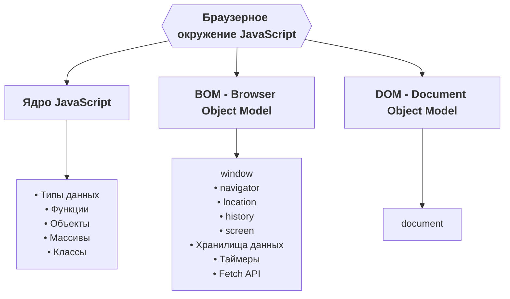
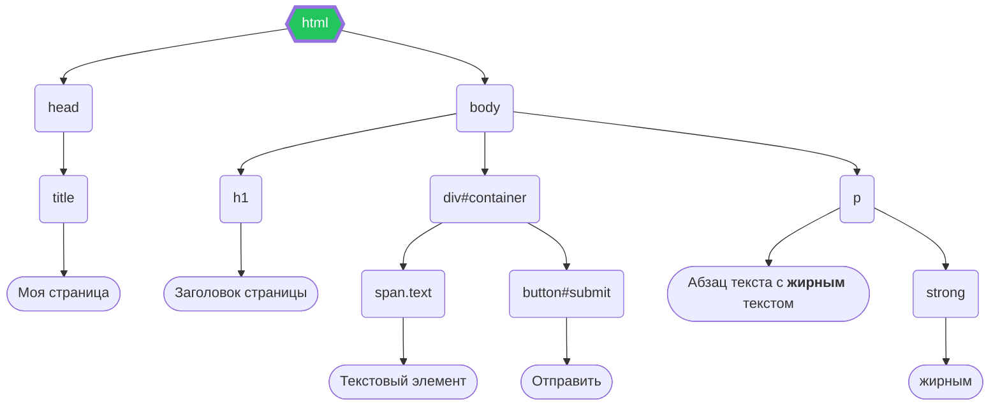

# Курс по веб-разработке

<h2 class="color-gray-400 fw-200">CSS. Основы работы JavaScript в браузере</h2>

---
layout: iframe-right
url: html/grid-demo.html
---

<style scoped>
  iframe {
    max-height: 100%;
    zoom: 0.5;
  }

  li {
    margin-bottom: 4px;
    font-size: 13px;
    line-height: 1.1rem;
  }
</style>

# CSS - Grid

> **Grid (сетка)** - способ отображения, позволяющий располагать элементы внутри сразу относительно двух измерений, то есть по столбцам и строкам

Устанавливается при помощи свойства `display: grid`

#### Основные определения
- **Грид-контейнер** - элемент, для которого установлено свойство `display: grid`
- **Грид-элемент** - дочерний элемент грид-контейнера, подчиняющийся правилам распололожения гридов
- **Грид-линии** - линии, разделяющие строки и столбцы
- **Грид-ячейка** - пространство между линиями
- **Грид-полоса**  - все ячейки одной строки/столбца
- **Грид-область** - любой прямоугольник из ячеек, то есть область, ограниченная четырьмя линиями

---
transition: none
---

<style scoped>
  li, li p {
    margin-top: 4px;
    font-size: 12px;
    line-height: 1.1rem;
    margin-bottom: 4px;
  }

  div {
    --slidev-code-font-size: 9px;
    --slidev-code-line-height: 12px;
  }
</style>

# CSS - Grid

Свойства грид-контейнера

- `grid-template-columns`, `grid-template-rows`, `grid-template` - задают размеры и количество столбцов или строк соответственно, например

  ```css
  .grid-container {
    display: grid;
    grid-template-columns: [cl-1] 150px [cl-2] auto [cl-3] 40% [cl-4]; /* 3 столбца */
    grid-template-rows: [rl-1] 250px [rl-2] 10vw [rl-3] 15rem [rl-4]; /* 3 ряда */
    grid-template: [rl-1] 250px [rl-2] 10vw [rl-3] 15rem [rl-4]
                   / [cl-1] 150px [cl-2] auto [cl-3] 40% [cl-4]; /* Короткая запись */
  }
  ```
  - В квадратных скобках можно указывать название линий. Это позволит удобнее позиционировать элементы относительно них
  - Если нужно повторить какое-то количество столбцов или строк, то можно использовать функцию `repeat(3, 200px)`
  - Для гридов есть специальная единица измерения `fr` (от англ. fraction - доля или часть), позволяющая автоматически распределять свободное пространство по ширине/высоте контейнера. Свободное пространство рассчитывается после того, как будут распределены все элементы с фиксированным размером
    ```css
    .grid-container {
      display: grid;
      grid-template-columns: repeat(1, 1fr); /* 3 столбца, ширина каждого - 1/3 от ширины контейнера */
      /* или */
      grid-template-columns: 1fr 100px 2fr; /* 1fr в данном случае - (100% - 100px) / 2 от ширины контейнера */
    }
    ```
  - `repeat(auto-fill, /* размер */)` - по возможности заполняет всё свободное пространство столбцами или строками автоматически, но если место остаётся, то создаются пустые
  - `repeat(auto-fit, /* размер */)` - аналогично `auto-fill`, но всё пустое пространство будет распределено между элементами

---

<style scoped>
  li, li p {
    margin-top: 4px;
    font-size: 12px;
    line-height: 1.1rem;
  }

  div {
    --slidev-code-font-size: 8px;
    --slidev-code-line-height: 10px;
  }
</style>

# CSS - Grid

Свойства грид-контейнера

<div class="grid grid-cols-2 gap-4">

<div>

- `grid-auto-columns`, `grid-auto-rows` - если элементов стало больше, чем явно заданных столбцов/строк, то это свойство задаст размеры для неявных, созданных автоматически
- `grid-auto-flow` - определяет, куда будут перемещаться неявно созданные элементы
  - `row` (по умолчанию) - выстраивание в ряды
  - `column` - выстраиваются в столбцы
  - `dense` - модификатор, позволяющий автоматически заполнять пустые места, если позволяют размеры элементов. Можно использовать с другими значениями, например: `grid-auto-flow: row dense`
- `gap`, `justify-content`, `justify-items`, `align-items` - свойства для выравнивания элементов, аналогичны свойствам flexbox
  - `place-items` - быстрый способ задать `align-items` и `justify-items`

</div>

- `grid-template-areas` - позволяет задать шаблон для сетки, используя наименования ячеек
  ```css
  .container {
    display: grid;
    grid-template-columns: repeat(3, 500px);
    grid-template-rows: repeat(4, 1fr);
    grid-template-areas:
      "header header header"
      "content content 👾"
      "content content ."
      "footer footer footer";
  }

  .item1 {
    grid-area: header;
  }

  .item2 {
    grid-area: content;
  }

  .item3 {
    grid-area: 👾;
  }

  .item4 {
    grid-area: footer;
  }
  ```
  - `.` - пустая ячейка

</div>

---

<style scoped>
  li, li p {
    margin-bottom: 4px;
    font-size: 11px;
    line-height: 1.1rem;
  }

  div {
    --slidev-code-font-size: 10px;
    --slidev-code-line-height: 12px;
  }
</style>

# CSS - Grid

Свойства грид-элемента

- `grid-column-start`, `grid-column-end`, `grid-row-start`, `grid-row-end` - свойства для расположения элемента внутри сетки
  Возможные значения
  - `<номер линии> или <название линии>`
  - `span <число>` - растягивание элемента на указанное кол-во ячеек
  - `span <название линии>` - растягивание элемента до линии с указанным названием
  - `auto` - автоматическое расположение
  ```css
  .grid-container {
    display: grid;
    grid-template-columns: [one] 1fr [two] 1fr [three] 1fr;
    grid-template-rows: [row1-start] 1fr [row1-end] 1fr 1fr;
  }

  .item1 {
    grid-column-start: 2;
    grid-column-end: five;
    grid-row-start: row1-start;
    grid-row-end: span 2;
  }
  ```
- `grid-column`, `grid-row` - свойства для быстрой записи, например: `grid-column: 2 / span 2`
- `grid-area` - задаёт либо название области, в которой расположить элемент (`grid-template-areas`), либо все 4 свойства расположения через `/`
- `justify-self`, `align-self`, `place-self` - свойства выравнивания
- `order` - порядок элемента

---

# CSS - Grid

Полезности

- Значения `min-content`, `max-content` и `auto`  - позволяют задать размер колонок и рядов относительно минимального и максимального размера контента, либо автоматически соответственно. **Доступны не только для grid**
- Функция `minmax` - позволяет одновременно задать минимальный и максимальный размеры, например: `grid-template-columns: minmax(300px, 1fr)` - столбцы займут 1 долю контейнера, но не менее 300 пикселей

---
layout: cover
---

# Практика по grid

https://appbrewery.github.io/gridgarden/#ru

---
layout: iframe-right
url: html/pseudoelements.html
---

<style scoped>
  li {
    font-size: 14px;
    line-height: 1.1rem;
    margin-bottom: 4px;
  }
</style>

# CSS - Псевдоэлементы

<div class="mb-4">

> **Псевдоэлементы** - элементы, которых не существует в HTML, но к которым можно обратиться для стилизации или создать посредством CSS

</div>

- `::before` `::after` - создание псевдоэлемента до/после указанного селектором. Для него обязательно нужно указать свойство `content: 'Какой-то текст'`, иначе он не отобразится. В остальном ведут себя как обычные элементы, по умолчанию - строчные
- `::first-letter` - позволяет настроить стиль первой буквы текста
- `::first-line` - позволяет настроить стиль первой строки текста
- `::selection` - позволяет настроить стили текста при выделении
- и другие...

---
layout: iframe-right
url: html/pseudoclasses.html
---

<style scoped>
  li {
    font-size: 10px;
    line-height: 0.9rem;
    margin-bottom: 4px;
  }
</style>

# CSS - Псевдоклассы

<div class="mb-4">

> **Псевдоэлементы** - особые селекторы, позволяющие стилизовать элементы в определённом состоянии (например при наведении мыши) или уточнить тип

</div>

- `:hover` - наведение мышью
- `:active` - взаимодействие с интерактивным элементом, например нажатие на кнопку
- `:enabled`, `:disabled` - включенные/отключенные элементы формы (атрибут `disabled`)
- `:visited` - посещённая ссылка
- `:is(h1, h2, h3, ...)` - выбор набора селекторов вместо их перечисления через запятую
- `:not(<selector>)` - если элемент не соответствует селектору, например `a:not(:visited)` - только непосещённые ссылки
- `:nth-child` - нахождение элементов на основе их порядка. Можно использовать выражения вида `1n`, `2n` и т.п., чтобы выбирать каждый 1-й, 2-й и так далее
- `:only-child` - если элемент является единственным у своего родителя
- и другие...

---
layout: iframe-right
url: https://doka.guide/css/transform-function/demos/sandbox/
class: iframe-zoom-70
---

<style scoped>
  li {
    font-size: 14px;
    line-height: 1.1rem;
    margin-bottom: 4px;
  }

  p:not(blockquote p) {
    font-size: 14px;
    line-height: 1.1rem;
    margin: 8px 0;
  }
</style>

# CSS - Transform

> Трансформации позволяют манипулировать пространственными свойствами элемента (размерами, положением, поворотом и т.п.), при этом не влияя на его реальное размещение на странице. Задаются при помощи свойства `transform`

Функции манипуляции:
- `translate(x, y, z)` - смещение элемента по осям
- `rotate(x, y, z)` - поворот относительно оси
- `scale(<n>)` `scale(x, y)` - пропорциональное масштабирование элемента. Так
- `skew(x, y)` - наклон элемента в двумерном пространстве по оси

Для всех функций также есть вариации для конкретных осей, например `translateX`, `rotateY` и т.п. А ещё в современных браузерах не обязательно писать `transform: <функция-трансформации>`, можно написать просто `<функция-трансформации>: ...`, например `scale: 2`

---
layout: iframe-right
url: html/transition.html
class: iframe-small
---

<style scoped>
  li {
    font-size: 12px;
    line-height: 1rem;
    margin-bottom: 4px;
  }

  p {
    font-size: 12px;
    line-height: 1rem;
    margin: 4px 0;
  }

  h4 {
    font-weight: 700;
    font-size: 16px;
  }
</style>

# CSS - Transition

> **Transition (переход)** - способ плавно изменить значение свойства между различными состояниями элемента (например при наведении мышью) во времени. Задаётся при помощи свойства `transition`

`transition` - это короткий способ записи, состоящий из следующих свойств:
- `transition-property` - название свойства для применения перехода. Можно использовать ключевое слово `all` для всех свойств
- `transition-duration` - длительность перехода
- `transition-timing-function` - функция определения скорости перехода (например `ease-in` - замедляется со временем, `ease-out` - ускоряется). Значение по умолчанию - `ease` - равномерная функция. Можно использовать набор готовых ключевых слов, или функцию `step()`, или кривую Безье (`cubic-bezier()`)
- `transition-delay` - задержка перед началом перехода

#### Дополнительно

- Плавно можно изменить все числовые значения, кроме `visibility` и `z-index`
- Ключевое слово `all` лучше не использовать
- Переходы свойств, связанные с изменением положения или размера (`left`, `top`, `width` и т.п.) плохо влияют на производительность, так как браузер должен пересчитывать размеры всех элементов. **Не относится к `transform`**

---

<style scoped>
  li {
    font-size: 14px;
    line-height: 1.2rem;
  }

  div {
    --slidev-code-font-size: 10px;
    --slidev-code-line-height: 12px;
  }
</style>

# Практика по JavaScript

<div class="grid grid-cols-2 gap-4">

<div>

- **Работа со строками**. Напишите функцию, определяющую является ли переданная ей строка палиндромом. Не забудьте про регистр, он не должен учитываться. **Палиндром** - это строка, одинаково читающаяся как слева направо, так и справо налево
  ```js
  console.log(isPalindrome('abcAcba')) // true
  console.log(isPalindrome('randomstring')) // false
  ```

- **Работа с массивами**. Напишите функцию, принимающую массив и возвращающий новый массив только с числами из входного
  ```js
  console.log(filterNumbers([1, "test", {}, 5, true, 10, undefined])) // [1, 5, 10]
  console.log(filterNumbers([{}, false, true, null, undefined])) // []
  ```

</div>

- **Работа с объектами**. Напишите программу для работы с таблицей лидеров:
  ```js
  const scoreboard = {
    "Ваня": 100,
    "Саша": 200,
  } 

  // Добавляет запись в переданный объект
  addScore(scoreboard, { "Вася": 300 })
  console.log(scoreboard) // { "Ваня": 100, "Саша": 200, "Вася": 300}

  // Удаляет запись с указанным аргументом из объекта
  removeScore(scoreboard, "Ваня")
  console.log(scoreboard) // { "Саша": 200, "Вася": 300}

  // Обновляет результаты существующих записей. 
  // Если в таблице нет указанного имени, ничего не делает
  updateScore(scoreboard, { "Саша": 500, "Непонятный чел": 300 }) 
  console.log(scoreboard) // { "Саша": 500, "Вася": 300}
  ```

</div>

---

<style scoped>
  p:not(h1 + p) {
    font-size: 14px;
    line-height: 1.1rem;
  }

  .mermaid { 
    width: fit-content;
    margin: 0 auto;
  }
</style>

# JavaScript в браузере

Браузерное окружение

Язык JavaScript изначально создавался для браузера, но с тех пор утекло много воды и теперь он может исполняться, например, на сервере или в других **средах**.

Каждая среда предоставляет своё **окружение** - это какие-то объекты и функции, дополняющие освновные возможности самого языка

<figure>



<figcaption>Возможности браузерного окружения</figcaption>

</figure>

---
transition: none
---

<style scoped>
  .mermaid { 
    width: fit-content;
    margin: 12px auto 0;
  }
</style>

# JavaScript в браузере

DOM

> **DOM (Document Object Model, объектная модель документа)** - специальная древовидная структура, повторяющая HTML и позволяющая им манипулировать (создавать, удалять и изменять) при помощи JavaScript. Все HTML-теги в DOM являются объектами с определённым набором свойств и методов.

> При этом DOM может использоваться не только в браузере. Например библиотеки, работающие с HTML на сервере, могут частично поддерживать его спецификацию 



<figcaption>Пример DOM-дерева</figcaption>

---
transition: none
---

<style scoped>
  p:not(h1 + p) {
    margin: 4px 0;
  }
</style> 

# JavaScript в браузере

DOM - объект `Document`

Основной объект в DOM - `document`, содержащий свойства и метода для работы с HTML-документом, например:
- `document.title` - заголовок документа
- `document.body` - объект тэга `body`
- `document.body` - объект тэга `head`
- `document.getElementById` — поиск элемента по идентификатору
- `document.getElementsByClassName` — поиск элементов по классу
- `document.getElementsByTagName` — поиск элементов по тегу
- `document.querySelector` — поиск первого элемента, подходящего под CSS-селектор
- `document.querySelectorAll` — поиск всех элементов подходящих под CSS-селектор

**Элементы** (также называются **узлами**) называются `Element`, он содержит свойства и методы для работы с конкретными вершинами дерева. У каждого элемента есть **родитель** (кроме корневого элемента) и могут быть **дочерние элементы**

---
transition: none
---

<style scoped>
  li {
    font-size: 14px;
    line-height: 1.2rem;
  }
</style>

# JavaScript в браузере

DOM - узлы и элементы

> **Узлы** - вершины DOM-дерева. Могут быть: элементами, комментариями, простым текстом и другими. У каждого узла есть **родитель** (кроме **корневого элемента**) и могут быть **дочерние элементы**

Элементы (объект типа `Element`) - узел DOM-дерева, объявленный при помощи тэга. Основные свойства и методы:
- **Связанные с HTML-атрибутами**
  - `id`, `className` - идентификатор и классы
  - `style` - объект со стилями
- **Связанные с DOM**
  - Все те же методы, что и у `document` - `getElementById`, `querySelector` и т.п., но ищут узлы только в поддереве
  - `parentElement`, `children`, `nextElementSibling` и `previousElementSibling` - родитель, список дочерних и соседних вершин
- **Связанные с содержимым**
  - `innerHTML`, `outerHTML` - HTML-разметка
  - `textContent` - текст всех вложенных узлов (без HTML-тегов)
- **Специфичные свойства** - те, что есть только у определённых типов элементов. Например, у тега `<input>` (это не просто `Element`, а `HTMLInputElement`) есть свойство `value`, но нет у условного `div`


---

<style scoped>
  li {
    font-size: 12px;
    line-height: 1.2rem;
  }
</style>

# JavaScript в браузере

DOM - Изменение документа

<div class="grid grid-cols-2 gap-4">

<div>

Для изменения документа (создания и удаления элементов) используются следующие методы:
- `document.createElement('<название-тэга>')` - создание элемента
- Вставка элемента в документ (`node` - любой элемент, например `document.body`)
  - `node.append(node1, node2)` - добавление в конец
  - `node.prepend(node1, node2)` - добавление в начало
  - `node.before`, `node.after` - добавление элементов перед/после вершины
  - `node.replaceWith` - замена вершины другими
  - `node.insertAdjacent<HTML/Text/Element>(where, content)` - вставка HTML/текста/элемента в определелённую позицию
- `node.cloneNode()` - клонирование (копирование) элемента. Если передать `true` в качестве параметра, то так же склонируются все потомки
- `node.remove()` - удаление узла

</div>

```js
const newElement = document.createElement('footer')
newElement.style.width = '100%'
newElement.className = 'fancy-footer'

document.body.append(newElement)

const clonedHeaderElem = document.cloneNode(
  document.getElementsByTagName('header')
)

const elemToRemove = document.querySelector('div.old')
elemToRemove.remove()
```

</div>

---
src: ./_shared.md#1
---

---

# Дополнительны материалы

## CSS
- [Doka - Гайд по grid](https://doka.guide/css/grid-guide/)
- [Lear CSS Grid - гайд по grid с примерами](https://learncssgrid.com/)
- [Шпаргалка по grid](https://yoksel.github.io/grid-cheatsheet/)
- [MDN - Псевдоэлементы](https://developer.mozilla.org/ru/docs/Web/CSS/Pseudo-elements)

## JavaScript
- [Doka - DOM](https://doka.guide/js/dom/)
- [Learn JavaScript - Изменение документа](https://learn.javascript.ru/modifying-document)