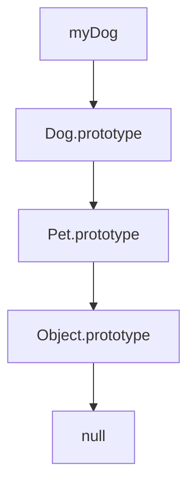
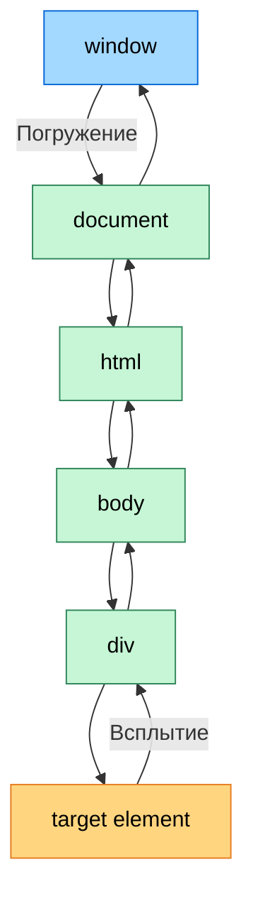

# Курс по веб-разработке

<h2 class="color-gray-400 fw-200">JavaScript - объекты, функции, ключевое слово `this`, классы и событийная модель</h2>

---
transition: none
---

# JavaScript - Объекты

> Объекты в JS - ссылочный тип данных, хранящий пары "ключ - значение"

```js
const obj = { key: 'val' }
// или
const obj = new Object()
```

- Объекты - **ссылочный тип**. Это значит, что при присвоении другой переменной того же объекта, копируется ссылка, а не сам объект
  ```js
  const a = { x: 1 };
  const b = a;   // b ссылается на тот же объект
  b.x = 42;

  console.log(a.x); // 42 (обе переменных указывают на один объект)
  ```
- Ключи - строки или символы (тип `Symbol`)
- Значения - любой тип данных
- Доступ к значения осуществляется при помощи `.` или `[]`
  ```js
  obj.key
  obj['key']
  ```

---
transition: none
---

# JavaScript - Объекты

- Функции, хранящиеся как значения, называются методами
  ```js
  const calc = {
    a: 10,
    b: 5,
    sum() { return this.a + this.b; }
  };
  ```
- Для итерации используется конструкция `for (let ket in obj) { ... }`
- Для удаления значения по ключу использутся ключевое слово `delete`
- Тип `Object` имеет встроенные методы:
  - `Object.keys(obj)` - возвращает массив ключей
  - `Object.value(obj)` - возвращает массив ключей
  - `Object.entries(obj)` - возвращает массив пар ключ-значение, например `[['key1', 1], ['key2', 2]]`
  - и другие

---

# JavaScript - Объекты

Геттеры и сеттеры

- Позволяют управлять доступом к свойствам объекта или класса
- Записываются с ключевыми словами **get** и **set**
- Используются как обычные свойства, но являются функциями

```js
const user = {
  name = '',
  get name() {
    return this._name.toUpperCase();
  }
  set name(value) {
    if (value.length < 3) {
      console.log("Имя слишком короткое");
      return;
    }
    this._name = value;
  }
}
```

---
transition: none
---

<style scoped>
  h4 {
    font-weight: 700;
  }
</style>

# JavaScript - Ключевое слово `this`

> `this` функции ссылается на контекст исполнения этого вызова и определяется исключительно тем, как была вызвана эта функция

<div class="grid grid-cols-2 gap-4 mt-4">

<div>

#### Неявное связывание (Implicit binding)

```js
var lesson = {
	teacher: "Шади",
	ask(question) {
		console.log(this.teacher, question);
	}
}

lesson.ask("Что такое неявное связывание?")
```

`this` в этом примере будет указывать на объект workshop, так как вызывается метод конкретного объекта - это и есть неявное связывание

</div>

<div>

#### Явное связывание (Explicit binding)

```js
function ask(question) {
	console.log(this.teacher, question);
}

var lesson = {
	teacher: "Шади"
}

ask.call(lesson, "Могу ли я явно связать контекст?")
ask.apply(lesson, ["Могу ли я явно связать контекст?"])
const boundAsk = ask.bind(lesson)
boundAsk(("Могу ли я явно связать контекст?"))
```

</div>

</div>

---

<style scoped>
  h4 {
    font-weight: 700;
    margin-top: 12px;
  }
</style>

# JavaScript - Ключевое слово `this`

> `this` **не определяется** в стрелочных функциях. В них он ведёт себя как любая другая переменная

#### Алгоритм определение указателя `this`
1. Функция вызывается с `new`?
	- Если да, то `this` будет указывать на неявный объект, создаваемый функцией-конструктором
2. Функция вызывается при помощи `call` или `apply` или была связана при помощи `bind`?
    - Если да, то `this` будет явно связанным контекстом
3. Функция вызывается как метод объекта?
	- Если да, то `this` будет указывать на объект, методом которого является функция
4. По умолчанию - `this = window (global)` (кроме `strict` режима)

---

<style scoped>
  h1 {
    font-size: 30px;
  }

  h4 {
    font-weight: 700;
  }
</style>

# JavaScript - Функции-конструкторы и IIFE

<div class="grid grid-cols-2 gap-4">

<div>

#### Функции-конструкторы

- Используются для создания однотипных объектов
- Название конструктора принято писать с заглавной буквы

```js
function User(name, age) {
  this.name = name;
  this.age = age;
  this.sayHi = function() {
    console.log(`Меня зовут ${this.name}`);
  };
}

const user1 = new User("Шади", 14);
user1.sayHi(); // Меня зовут Шади
```

</div>

<div>

#### IIFE (Immediately Invoked Function Expression)

- Функция, которая выполняется сразу после создания
- Используется для изоляции кода и создания локальной области видимости

```js
(function() {
  console.log("Я выполняюсь сразу!");
})();

(() => {
  console.log("И я тоже!");
})();
```

</div>

</div>

---

<style scoped>
  p, li {
    font-size: 10px;
    line-height: 1rem;
  }

  li {
    margin-bottom: 4px;
  }

  div.mermaid {
    width: fit-content;
    margin: 0 auto;
  }

  div {
    --slidev-code-font-size: 8px;
    --slidev-code-line-height: 10px;
  }
</style>

# JavaScript - Прототипы и наследование

> **Наследование** - механизм, позволяющий одному объекту или классу использовать свойства или методы другого

> В JavaScript оно реализовано через **цепочку прототипов (prototype chain)**

> **Прототип** - это специальное скрытое свойство объекта - `[[Prototype]]`, которое либо ссылается на другой объект, либо равно `null`. При обращении к свойству какого-то объекта оно сначала ищется в самом объекте, если его нет, то в прототипе, потом в прототипе протитипа и так далее. Это и называется **цепочной прототипов**

<div class="grid grid-cols-2 gap-4 mt-4">

<div>

```js
function Pet(name) {
    this.name = name;
}

Pet.prototype.speak = function() {
    console.log(`${this.name} издает звук`);
};

function Dog(name, breed) {
    Pet.call(this, name);
    this.breed = breed;
    this.bark = () => console.log(`${this.breed} ${this.name} гавкает`)
}

Object.setPrototypeOf(Dog.prototype, Pet.prototype)

const myDog = new Dog("Шарик", "Лабрадор");
```

- `__proto__` - свойство для обращение к скрытому `[[Prototype]]`. Считается устаревшим, лучше использовать `Object.getPrototypeOf` и `Object.setPrototypeOf`
- `prototype` - свойство функций-конструкторов, определяющий базовый прототип, с которым будут создаваться все экземпляры

</div>

<div>



Все создаваемые объекты имеют базовый прототип - `Object.prototype`, но можно создать объект без прототипа - `Object.create(null)`

</div>

</div>

---
transition: none
---

<style scoped>
  h4 {
    font-weight: 700;
    margin-top: 12px;
  }

  li {
    font-size: 12px;
    line-height: 1.1rem;
  }

  div {
    --slidev-code-font-size: 9px;
    --slidev-code-line-height: 11px;
  }
</style>

# JavaScript - Классы

> Классы в JS - на самом деле просто синтаксический сахар над функциями-конструкторами, автоматически добавляющий методы в прототип

#### Объявление
```js
class Pet {
  constructor(name) {
    this.name = name;
  }
  speak() {
    console.log(`${this.name} издает звук`);
  }
}

class Dog extends Pet {
  constructor(name, breed) {
    super(name);
    this.breed = breed;
  }
  bark() {
    super.speak()
    console.log(`${this.breed} ${this.name} гавкает`)
  }
}
```

- Объект, созданный при помощи ключевого слова `new`, называется **экземпляром**
- Ключевое слово `super` - способ вызывать конструктор родительского класса или обратиться к свойству прототипа
- Для проверки принадлежности объекта классу (в том числе наследуемому) используется оператор `instanceof` (например, `dog instanceof Dog`)

---

<style scoped>
  h4 {
    font-size: 18px;
    font-weight: 700;
    margin-bottom: 8px;
  }

  li {
    font-size: 14px;
    line-height: 1.2rem;
    margin-bottom: 4px;
  }

  div {
    --slidev-code-font-size: 12px;
    --slidev-code-line-height: 14px;
  }
</style>

# JavaScript - Классы

<div class="grid grid-cols-3 gap-4">

<div>

#### Приватные (Private) свойства и методы

- Обозначаются через `#` перед именем
- Доступны **только внутри класса**
- Нельзя обратиться извне напрямую

```js
class User {
  #password;
  constructor(name, password) {
    this.name = name;
    this.#password = password;
  }
  checkPassword(pass) {
    return this.#password === pass;
  }
  #privateMethod() {}
}
```

</div>

<div>

#### Защищённые (Protected) свойства и методы

- Обычно обозначаются `_` перед именем
- Доступны внутри класса и его потомков, но работают как соглашение, т.е. не гарантируется строгая защита

```js
class User {
  _password;
  constructor(name, password) {
    this.name = name;
    this._password = password;
  }
  checkPassword(pass) {
    return this._password === pass;
  }
  _protectedMethod() {}
}
```

</div>

<div>

#### Статические методы и свойства

- Обозначаются ключевым словом `static`
- Принадлежат **классу**, а не экземпляру

```js
class MathHelper {
  static PI = 3.14159;
  static square(x) {
    return x * x;
  }
}

console.log(MathHelper.PI);
console.log(MathHelper.square(5));
```

</div>

</div>

---

<style scoped>
  li {
    font-size: 18px;
    line-height: 1.6rem;
  }
</style>

# Практика

1. Напишите функцию-конструктор `LibraryBook`:
    - Свойства: `title`, `author`, `copies` 
    - Метод `borrowBook()` уменьшает количество доступных копий (не меньше 0)
    - Метод `returnBook()` увеличивает количество доступных копий
    - Метод `isAvailable()`, который проверяет, есть ли свободные экземпляры
2. Создайте класс `Product`:
    - Свойства: `name`, `price`, `discount`
    - Геттер `finalPrice`, который возвращает цену с учётом скидки
    - Сеттер `discount` ограничивает скидку диапазоном **0–50%** 
    - Статический метод `compare(p1, p2)`, который сравнивает продукты по цене
3. Постройте иерархию сотрудников:
    - `Employee`: `name`, `salary`, метод `getInfo()`
    - `Manager` (наследуется от `Employee`): добавляет `team` (массив подчинённых `Employee`) и метод `addEmployee()`
    - `Director` (наследуется от `Manager`): может повышать зарплату сотрудникам команды (`increaseSalary(employeeName, percent)`).


---

<style scoped>
  td {
    font-size: 14px;
  }
</style>

# JavaScript - Строгий режим

> **Строгий режим (Strict mode)** - необходим для написания более безопасного и предсказемого кода. Включается директивой `"use strict";` в начале файла или функции.

<div class="table-dense mb-4">

| Особенность                         | Обычный режим                | Строгий режим        |
|-------------------------------------|------------------------------|-------------------------------------|
| Необъявленные переменные            | Создаются в `window`         | ❌ Ошибка                           |
| Значение `this` в функциях          | `window` (или `globalThis`)  | `undefined`                         |
| Дублирование названий параметров функции     | Разрешено                    | ❌ Ошибка                           |
| `delete` для переменных/функций     | Игнорируется                 | ❌ Ошибка                           |
| Использование `with`                | Разрешено                    | ❌ Запрещено                        |
| Зарезервированные слова (например, `enum`) | Можно использовать как имена | ❌ Ошибка                           |

</div>

```js
'use strict';

x = 10; // ❌ Ошибка (переменная не объявлена)
function f(a, a) {} // ❌ Ошибка (дубликат параметров)
delete f // ❌ Ошибка (удаление функции)
```

---
transition: none
---

# JavaScript - Событийная модель

<div class="mb-4">

> Для любой интерактивности веб-страницы с пользователем в JavaScript используются **события** (**events**). Это специальные объекты, которые создаются браузером (но можно создать и вручную при помощи JS) в качестве сигнала на какое-либо действие от пользователя (клик мышью, нажатие клавиши, прокрутка страницы и т.п.), а ваша программа может их каким-то образом обработать.

</div>

```js
// Через атрибут в HTML (не рекомендуется)
<button onclick="alert('На кнопку нажали!')">Кнопка</button>

// Через свойство
elem.onclick = () => console.log("На кнопку нажали!");

// Стандартный способ
// `e` - объект события
elem.addEventListener("click", (e) => console.log("На кнопку нажали!", e));
```

---

<style scoped>
  h4 {
    font-weight: 700;
    margin-top: 12px;
  }

  li, p:not(h1 + p) {
    font-size: 13px;
    line-height: 1.1rem;
  }

  div.mermaid {
    width: fit-content;
    margin: 0 auto;
  }
</style>

# JavaScript - Событийная модель

Погружение и всплытие

<div class="grid grid-cols-4 gap-4">

<div class="grid-col-span-3">

Когда в браузере происодит событие, соответствующий ему объект проходит следующие этапы:
1. Погружение (Capturing phase) - cобытие создаётся в `window` и начинает распротраняться вниз по DOM-дереву
    - Если обработчик зарегистрирован с параметром `capture=true` (`addEventListener("click", handler, true)`), он сработает уже на этом этапе, когда дойдёт до нужного элемента
2. Целевая фаза (Target phase) - событие достигает целевого элемента
3. Всплытие (Bubbling phase) - событие всплывает обратно вверх по DOM-дереву
  - По умолчанию обработчик сработает на этой фазе, если не указан `capture=true`

Обработчики событий срабатывают при появлении такого же события для всех вложенных элементов

#### Управление событием
- `event.stopPropagation()` - прекращение вспылытия события
- `event.stopImmediatePropagation()` - предотвращает всплытие и срабатывание других обработчиков для события такого же типа
- `event.preventDefault()` - отменяет действие по умолчанию (например, переход по ссылке при клике на `<a>`)

</div>



</div>

---

# Практика


---
src: ./_shared.md#1
---

---

# Дополнительны материалы

- [learn.javascript.ru - Объекты: основы](https://learn.javascript.ru/object-basics)
- [learn.javascript.ru - Прототипы, наследование](https://learn.javascript.ru/prototypes)
- [learn.javascript.ru - Классы](https://learn.javascript.ru/classes)