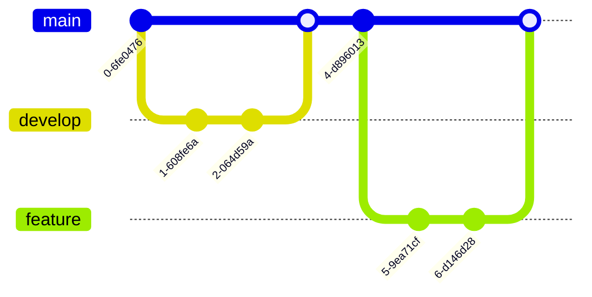

# Курс по веб-разработке

<h2 class="color-gray-400 fw-200">Git.<br/>JS: делегирование событий, структуры данных. Адаптивность.</h2>

---
transition: none
---

# Git

> **Git** - система контроля версий. Она позволяет отслеживать историю изменений и хранить различные версии вашего проекта, а также возвращаться к старым версиям, сравнивать изменения и объединять работу нескольких людей. Работает на основе веток и коммитов

<br />



---

<style scoped>
  li {
    font-size: 18px;
    line-height: 1.5rem;
    margin-bottom: 2px;
  }
</style>

# Git

Основные определения

- **Репозиторий (repository)** — хранилище проекта с историей изменений
- **Remote (удалённый репозиторий)** — версия проекта на удалённом сервере (например GitHub или GitLab)
- **Commit (коммит)** — "снимок" состояния файлов на определённый момент времени. Каждый коммит имеет идентификатор - **хэш (hash)** коммита

> **Важно**: Коммиты в git хранят только саму историю изменений по сравнению с предыдущим коммитом, а не все файлы на момент создания коммита

- **Branch (ветка)** — параллельная линия разработки, независимая от основной. Позволяет вносить изменения в проект, не влияя при этом на основную его версию
- **Merge (слияние)** — объединение изменений из одной ветки в другую 
- **Clone (клонирование)** — копия удалённого репозитория на локальный компьютер.  
- **Pull** — загрузка изменений из удалённого репозитория
- **Push** — отправка своих изменений в удалённый репозиторий
- **Staging area (индекс)** — "черновик" всех изменений, собранных перед созданием коммита
- **HEAD** — указатель на текущий коммит или ветку, на которой вы находитесь

---

# Git

Пример работы


---

<style scoped>
  h3 {
    font-size: 18px;
    line-height: 1.4rem;
    font-weight: 700;
    margin: 4px 0;
  }

  p:not(:is(:has(a), h1 + p)) {
    font-size: 12px;
    line-height: 1.1rem;
    margin: 4px 0;
  }
</style>

# Git

Установка и первоначальная настройка

https://git-scm.com/downloads - ссылка на официальный сайт с файлом для установки

### Настройка имени и электронной почты

С ними будут ассоциироваться созданные коммиты

```bash
git config --global user.name "Имя Фамилия" # Установка имени, от которого будут производиться коммиты
git config --global user.email "some_email@example.com" # Установка электронной почты
```

### Название ветки по умолчанию

Раньше использовалось название `master`, сейчас - `main`

```bash
git config --global init.defaultBranch main
```

### Оработка окончаний строк

Разные операционные системы используют разные окончания строк, в Unix/MacOS - LF (`\n`), в Windows - CRLF (`\r\n`), из-за чего могут появляться лишние изменения

::code-group

```sh [Windows]
git config --global core.autocrlf true
git config --global core.safecrlf warn
```

```sh [Unix/MacOs]
git config --global core.autocrlf input
git config --global core.safecrlf warn
```

::

---
class: table-dense
---

<style scoped>
  td {
    font-size: 8px;
  }

  th {
    padding: 4px;
    
  }
</style>

# Git

Основные команды

| | |
|------------------------|---------------------------------------------------------------|
| `git init`             | Создать новый локальный репозиторий                           |
| `git clone <url>`      | Склонировать удалённый репозиторий на компьютер              |
| `git status`           | Показать текущее состояние репозитория                        |
| `git add <файл>`       | Добавить изменения в индекс (staging area)                   |
| `git add .`            | Добавить все изменения в индекс                               |
| `git commit -m "Сообщение"`  | Создать коммит с указанным сообщением                         |
| `git log`              | Показать историю коммитов                                     |
| `git branch`           | Показать список веток                                         |
| `git branch <имя>`     | Создать новую ветку                                           |
| `git checkout <ветка или хэш коммита>` | Переключиться на указанную ветку или коммит                               |
| `git merge <ветка>`    | Объединить указанную ветку с текущей                         |
| `git remote -v`        | Показать список подключённых удалённых репозиториев           |
| `git remote add <название_репозитория> <url>` | Добавить удалённый репозиторий         |
| `git push`             | Отправить коммиты в удалённый репозиторий                     |
| `git fetch`            | Скачать изменения из удалённого репозитория без слияния       |
| `git pull`             | Получить изменения из удалённого репозитория (= `git fetch + git merge`) |
| `git reset <файл>`     | Удалить изменения из индекса (staging area)                  |
| `git diff`             | Показать разницу между рабочей директорией, индексом и коммитом |

---

<style scoped>
  h3 {
    font-size: 18px;
    line-height: 1.4rem;
    font-weight: 700;
    margin: 4px 0;
  }
</style>

# Git

Конфликты изменений

> **Конфликт изменения** - это ситуация, при которой git не может автоматически объединить изменения из разных веток. Git покажет сообщения о конфликтах при выполнении `merge` или `pull`

### Возможные причины

- Одновременное редактирование одного и того же файла в разных ветках  
- Одновременное изменение одной строки или блока кода  
- Разные версии одного файла в локальном и удалённом репозитории

### Как решать

1. Открыть файл и найти конфликтные участки (будут помечены специальными строками `<<<<<<<`, `=======`, `>>>>>>>`)  
2. Объединить изменения вручную или выбрать правильный вариант, если вы пользуетесь визуальным инструментом (средой разработки или git с пользовательским интерфейсом)
3. После исправления сделать `git add <файл>` 
4. Завершить слияние коммитом `git commit`

---

# Git

Алиасы (Alias)

В git можно настроить alias'ы - псевдонимы, например чтобы использовать короткие версии существующих команд

```bash
git config --global alias.s status
git s

git config --global alias.co checkout
git co main

git config --global alias.br branch
git br

git config --global alias.ci commit
git ci -m 'Сообщение'
```

---

# Git

.gitignore

> **`.gitignore`** - специальный файл, содержащий пути до файлов, которые git будет игнорировать. То есть их нельзя будет добавить в индекс и закоммитить их изменения. Рабочая директория может содержать сколько угодно таких файлов

```
# Логи
*.log
npm-debug.log*

# Кэш
.cache/
tmp/
*.tmp

# ОС-файлы
.DS_Store
Thumbs.db

# Файлы IDE
.vscode
.idea
```

---

<style scoped>
  li, p:not(:is(h1 + p, blockquote > p)) {
    font-size: 14px;
    line-height: 1.2rem;
    margin-bottom: 2px;
  }

  h3 {
    font-size: 18px;
    line-height: 1.4rem;
    font-weight: 700;
    margin: 4px 0;
  }
</style>

# JavaScript

Делегирование событий

> **Делегирование событий** - подход, при котором обработчики событий назначаются не на каждый отдельный элемент, а на их общего предка, который перехватывает событие

### Зачем нужно

- Уменьшает количество обработчиков в DOM  
- Позволяет обрабатывать динамически созданные элементы
- Улучшает производительность при большом числе элементов

Делегирования можно добиться за счёт встроеного механизма **всплытия** и свойства `target` объекта события
- `target` - элемент, на котором **событие было создано** (например произошёл клик мышью). Не зависит от того, для какого элемента был добавлен обработчик
- `currentTarget` - элемент, на котором **в данный момент срабатывает обработчик события**

```js
const list = document.querySelector('#myList');

list.addEventListener('click', function(event) {
  if (event.target.tagName === 'LI') {
    console.log('Нажат элемент:', event.target.textContent);
  }
});
```

---

# JavaScript

Структуры данных

В JavaScript есть несколько встроенных структур данных: `Set` (множество), `Map` (коллекция ключ-значение), `WeakSet` и `WeakMap`

- `Set` - коллекция уникальных элементов. При добавлении одинаковых значений будет содержать единственное
- `Map` - набор пар ключ-значение. Похож на объект, но имеет несколько существенных отличий
- `WeakSet` и `WeakMap` - используются редко, про них говорить пока не будем. Но на всякий случай на последнем слайде есть ссылка

---

<style scoped>
  div {
    --slidev-code-font-size: 10px;
    --slidev-code-line-height: 12px;
  }
</style>

# JavaScript

`Set`

<div class="grid grid-cols-2 gap-2">

```js
// Создание Set
const mySet = new Set();

// Добавление элементов
mySet.add(1);
mySet.add(2);
mySet.add(2); // не добавится, так как 2 уже есть

console.log(mySet); // Set {1, 2}

// Проверка наличия элемента
console.log(mySet.has(1)); // true
console.log(mySet.has(3)); // false

// Удаление элемента
mySet.delete(1);
console.log(mySet); // Set {2}

// Перебор элементов
for (const value of mySet) {
  console.log(value);
}

// Очистка Set
mySet.clear();
console.log(mySet); // Set {}
```

<div>

- Хранит только уникальные значения
- Операции `add`, `has`, `delete` и `clear` - значительно быстрее (обычно `O(1)`, но зависит от браузера), чем аналоги для массивов

</div>

</div>

---

<style scoped>
  div {
    --slidev-code-font-size: 9px;
    --slidev-code-line-height: 12px;
  }
</style>

# JavaScript

`Set`

<div class="grid grid-cols-2 gap-2">

```js
// Создание Map
const myMap = new Map();

// Добавление элементов
myMap.set('name', 'Alice');
myMap.set('age', 25);
myMap.set(1, 'Number key');

console.log(myMap.get('name')); // Alice
console.log(myMap.get(1));      // Number key

// Проверка наличия ключа
console.log(myMap.has('age'));  // true
console.log(myMap.has('gender')); // false

// Удаление ключа
myMap.delete('age');

// Перебор Map
for (const [key, value] of myMap) {
  console.log(key, value);
}

// Размер Map
console.log(myMap.size); // 2

// Очистка Map
myMap.clear();
console.log(myMap.size); // 0
```

<div>

Отличия от объекта:
- Ключом может выступать любой тип (ключа объекта - строка или тип `Sybmol`)
- Гарантирует порядок элементов
- Имеет встроенное свойство для получения размера - `size`
- Можно итерироваться при помощи цикла `for...of`
- Оптимизирован для частого добавления и удаления пар
- Имеет набор удобных встроенных методов

</div>

</div>

---

<style scoped>
  h3 {
    font-weight: 700;
    margin-bottom: 4px;
  }
  
  li {
    font-size: 14px;
    line-height: 1.3rem;
  }
</style>

# CSS

Адаптивность

> **Адаптивность** - это способность веб-страницы подстраиваться под разные размеры экранов и устройства, например компьютеры, планшеты или смартфоны

### Как реализуется

- Медиа-запросы (Media Queries) в CSS
- Гриды (grids)
- Флексбокс (flexbox)
- Относительные единицы измерения (`%`, `em`, `rem`, `vw`, `vh`)
- Адаптивные шрифты и элементы интерфейса
  - Текст должен оставаться читаемым, а интерактивные элементы интерфейса - удобными для взаимодействия
- touch-события - события, происходящие при взаимодействия пользователя с сайтом при помощи сенсорного экрана (`touchstart` - касание экрана, `touchmove` - движение по экрану, `touchend` - конец касания)
- Мета-тэг viewport (`<meta name="viewport" content="...">`) - позволяет контролировать размер и масштаб видимой части веб-страницы на устройстве
  - `width=device-width, initial-scale=1.0` - ширина viewport'а равна ширине экрана, начальный масштаб - 100%
  - `maximum-scale=1.0` - максимальный масштаб
  - `minimum-scale=1.0` - минимальный масштаб
  - `user-scalable=no` - запрещает масштабирование на странице

---
transition: none
---

<style scoped>
  h3 {
    font-size: 18px;
    line-height: 1.4rem;
    font-weight: 700;
    margin: 8px 0;
  }
</style>

# CSS

Медиа-запросы (Media Queries)

> **Медиа-запросы** - специальные директива CSS, позволяющие применять разные стили в зависимости от различных характеристик устройства: ширины экрана, ориентации, разрешения и других

### Общий синтаксис
```css
@media [тип устройства] [характеристика устройства] {
  /* CSS-правила */
}
```

### Типы устройств
- `print` - печать или экспорт в PDF
- `screen` - для экранов
- `all` - значение по умолчанию, применяется ко всем устройствам

---

# CSS

Примеры медиа-запросов

```css
/* Любые устройства и максимальная ширина экрана.
  Стили применятся, если ширина экрана <= 1280px */
@media (max-width: 1280px) { … }
```

```css
/* Любые устройства и минимальная ширина экрана.
  Стили применятся, если ширина экрана >= 800px */
@media (min-width: 800px) { … }
```

```css
/* Принтеры и альбомная ориентация */
@media print and (orientation: landscape) { ... }
```

```css
/* Любые устройства и соотношение сторон 16/9 */
@media (aspect-ratio: 16 / 9) { … }
```

---

# Практика


---
src: ./_shared.md#1
---

---

# Дополнительные материалы

## Git

- [Learn Git Branching](https://learngitbranching.js.org/?locale=ru_RU) - интерактивный учебник по git (на русском)
- [Git Immersion](https://gitimmersion.com/lab_01.html) - учебник по git с практическими заданиями (на английском)
- [GitHowTo](https://githowto.com/ru) - учебник по git с практическими заданиями (на русском)
- [GitHub Docs - Гайд по добавлению ssh-ключа](https://docs.github.com/en/authentication/connecting-to-github-with-ssh/generating-a-new-ssh-key-and-adding-it-to-the-ssh-agent)

## JavaScript

- [learn.javascript.ru - WeakMap и WeakSet](https://learn.javascript.ru/weakmap-weakset)

## CSS

- [Doka - @media](https://doka.guide/css/media/) - гайд по медиа-запросам