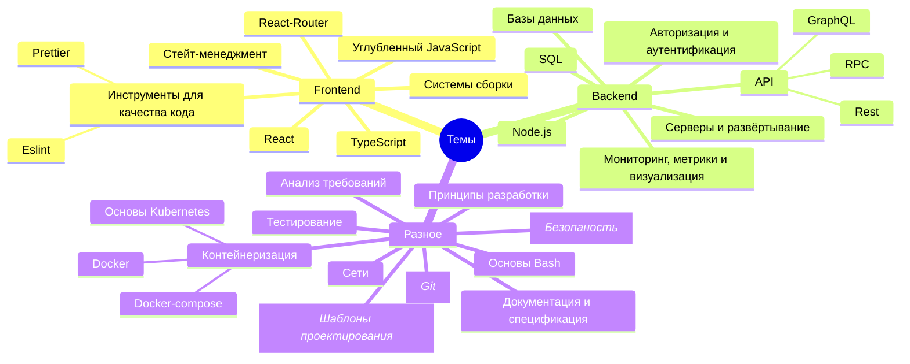
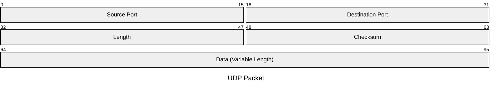
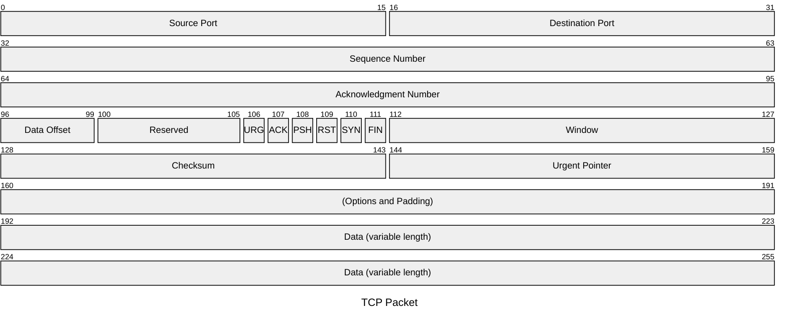

# Курс по веб-разработке

<h2 class="color-gray-400 fw-200">Вводное занятие</h2>

---
layout: image-right
image: /me.jpg
hideInToc: true
---

# Немного обо мне

<ul>
  <li v-click="1">~5 лет коммерческого опыта</li>
  <li v-click="1">Senior фронтенд-разработчик в <code class="text-blue">Avito</code></li>
  <li v-click="2">Выпускник <code class="text-yellow">МатИнфо лицея</code></li>
  <li v-click="2">Выпускник <code class="text-blue">Программной Инженерии ВШЭ</code></li>
  <li v-click="3">Зовут меня <code>Шáди</code></li>
</ul>

---
hideInToc: true
---

# Цели курса

- Сделать из вас лучших будущих специалистов
- Понемногу подготовить к ВУЗу
- Дать практический опыт разработки
- **Подготовить к олимпиаде [PROD](https://prodcontest.ru/)**

---
transition: slide-left
hideInToc: true
---

# Темы курса

Из чего состоит современный веб



---
layout: cover
transition: slide-left
hideInToc: true
---

# Совпадает ли это с вашими ожиданиями?

И что вы хотели бы изучить?

---
hideInToc: true
---

# Содержание

<Toc />

---
transition: slide-left
layout: cover
hideInToc: true
---

# Компьютерные сети

---

# Компьютерные сети

Основные определения

> **Компьютерная (вычислительная, информаицонно-вычислительная) сеть** - система взаимосвязанных устройств для передачи данных между ними

<br />

> **Интернет ("Сеть сетей")** - глобальная сеть, объединяющая множество других, более малых, сетей из различных устройств. Построена на **стеке протоколов TCP/IP**.

<br />

> **Всемирная паутина (WWW, World Wide Web)** - рапределённая система связанных между собой документов (веб-страницы, изображений, видео и т.п.), расположенных на множестве разных устройств (веб-серверов), подключённых к сети **Интернет**

---
transition: none
---

# Модель OSI

Определение

> **Модель OSI (Open Systems Interconnection)** - эталонная модель взаимодействия открытых систем. Описывает, как устройства в локальных и глобальных сетях обмениваются данными и что происходит с этими данными. Её предложили в 1984 году инженеры из **Международной организации по стандартизации (ISO)**, которая работала над единым стандартом передачи данных по интернету. Каждый уровень выполняет специфические функции и взаимодействует с уровнями непосредственно выше и ниже.

---
transition: slide-left
hideInToc: true
---

<style scoped>
  thead td {
    font-weight: 600;
    font-size: 16px;
  }
  
  td {
    font-size: 13px;
  }
</style>

# Модель OSI

<table>
  <thead>
      <tr>
          <td></td>
          <td>Уровень</td>
          <td>Тип данных</td>
          <td>Функции</td>
      </tr>
    </thead>
    <tbody>
      <tr>
          <td rowspan="4">Host layers (уровни хоста)</td>
          <td class="fw-400">Прикладной (application)</td>
          <td rowspan="3">Данные (строки из байтов)</td>
          <td>Доступ к сетевым службам</td>
      </tr>
      <tr>
          <td>Представления (presentation)</td>
          <td>Представление и шифрование данных</td>
      </tr>
      <tr>
          <td>Сеансовый (session)</td>
          <td>Управление сеансом связи</td>
      </tr>
      <tr>
          <td>Транспортный (transport)</td>
          <td>Сегменты (segment)/Дейтаграммы (datagram)</td>
          <td>Прямая связь между конечными пунктами и надёжность</td>
      </tr>
      <tr>
          <td rowspan="3">Media layers (уровни среды)</td>
          <td class="fw-400">Сетевой (network)</td>
          <td>Пакеты (packet)</td>
          <td>Определение маршрута и логическая адресация</td>
      </tr>
      <tr>
          <td>Канальный (data link)</td>
          <td>Биты/Кадры (frame)</td>
          <td>Физическая адресация</td>
      </tr>
      <tr>
          <td>Физический (physical)</td>
          <td>Электрические сигналы, биты</td>
          <td>Работа со средой передачи, сигналами и двоичными данными</td>
      </tr>
    </tbody>
</table>

---
transition: none
---

# Модель (стек протоколов) TCP/IP

Определение

> **Стек протоколов TCP/IP (Transmission Control Protocol/Internet Protocol, протокол управления передачей/протокол интернета)** — сетевая модель, описывающая процесс передачи цифровых данных. Она названа по двум главным протоколам, по этой модели построена глобальная сеть интернет.

---
hideInToc: true
---

# Модель (стек протоколов) TCP/IP

<table>
  <thead>
      <tr>
          <td>Уровень</td>
          <td>Протоколы</td>
      </tr>
    </thead>
    <tbody>
      <tr>
          <td>Прикладной (application)</td>
          <td>HTTP, HTTPS, SMTP, DNS, FTP</td>
      </tr>
      <tr>
          <td>Транспортный (trasport)</td>
          <td>TCP, UDP</td>
      </tr>
      <tr>
          <td>Межсетевой (internet)</td>
          <td>IPv4, IPv6, ICMP</td>
      </tr>
      <tr>
          <td>Канальный (link)</td>
          <td>MAC, Ethernet, Wi-Fi</td>
      </tr>
    </tbody>
</table>

---

<style scoped>
  thead th {
    font-size: 14px;
  }

  td {
    font-size: 12px;
  }

  .no-accent tbody > tr > td:first-child {
    font-weight: 300;
  }
</style>

# Сравнение OSI и TCP/IP

<div class="table-dense">

|            | OSI                                                                           | TCP/IP                                           |
| ---------- | ----------------------------------------------------------------------------- | ------------------------------------------------ |
| Структура  | Состоит из 7-и уровней                                                        | Состоит из 4-х уровней                           |
| Протоколы  | Не привязана к конкретным сетевым протоколам                                  | Все уровни связаны с определёнными протоколами   |
| Применение | В образовательных и исследовательских целях, т.е. модель скорее теоретическая | Для реального построения сетевого взаимодействих |

</div>

<Arrow v-click="1" v-bind="{ x1: '48%', y1: '62%', x2: '52%', y2: '62%', 'two-way': true, width: 1, color: '#facc15' }" />
<Arrow v-click="1" v-bind="{ x1: '48%', y1: '70%', x2: '52%', y2: '70%', 'two-way': true, width: 1, color: '#facc15' }" />
<Arrow v-click="1" v-bind="{ x1: '48%', y1: '75%', x2: '52%', y2: '75%', 'two-way': true, width: 1, color: '#facc15' }" />
<Arrow v-click="1" v-bind="{ x1: '48%', y1: '82%', x2: '52%', y2: '82%', 'two-way': true, width: 1, color: '#facc15' }" />

<div v-click="1" class="grid grid-cols-2 gap-16 mt-8 table-dense">
  <table class="no-accent bg-gray-700">
    <tbody>
      <tr>
        <td>Прикладной уровень</td>
      </tr>
      <tr>
        <td>Уровень представления</td>
      </tr>
      <tr>
        <td>Сеансовый уровень</td>
      </tr>
      <tr>
        <td>Транспортный уровень</td>
      </tr>
      <tr>
        <td>Сетевой уровень</td>
      </tr>
      <tr>
        <td>Канальный уровень</td>
      </tr>
      <tr>
        <td>Физический уровень</td>
      </tr>
    </tbody>
  </table>

  <table class="no-accent bg-gray-700">
    <tbody>
      <tr>
        <td style="height: calc(28px * 3)" class="py-0">Прикладной уровень</td>
      </tr>
      <tr>
        <td>Транспортный уровень</td>
      </tr>
      <tr>
        <td>(Меж)сетевой уровень</td>
      </tr>
      <tr>
        <td style="height: calc(28px * 2)" class="py-0">Канальный уровень</td>
      </tr>
    </tbody>
  </table>
</div>

---

<style scoped>
  div code {
    font-size: 20px;
  }
</style>

# Адресация

<div class="grid grid-cols-3 mt-28 gap-4">
  <div v-click>
    <h3>MAC-адрес (L1)</h3>
    <p>
      <code>00:1C:BF:0C:81:2B</code>
    </p>

<div class="mt-8">

::code-group

```sh [Windows]
getmac /v /fo list
```

```sh [MacOs]
ifconfig en0 | awk '/ether/{print $2}'
```

```sh [Linux]
ip a | grep ether | gawk '{print $2}'
```

::

</div>

  </div>

  <div v-click>
    <h3>IP-адрес (L2)</h3>
    <p>
      <code><span v-mark.yellow="2">192.168.0</span>.1/24</code>
    </p>

  <div class="mt-8">

::code-group

```sh [Windows]
ipconfig
```

```sh [MacOs]
ipconfig getifaddr en0
```

```sh [Linux]
ip --brief address show
```

::

  </div>

  </div>

  <div v-click="3">
    <h3>Порт (L3)</h3>
    <p>
      <code>25565</code>
    </p>

<div class="mt-8">

::code-group

```sh [Windows]
netstat -abn
```

```sh [MacOs]
lsof -Pn -i4
```

```sh [Linux]
netstat -lntu
```

::

</div>
  </div>
</div>

---
layout: cover
---

# Протоколы

> **Протоколы передачи данных** - набор соглашений, согласно которым осуществляется обмен данными между различными программами

---

# UDP

User Datagram Protocol

Пакеты называют **датаграммами**

### Характеристики

<div class="mb-4 font-size-4">

- Отправка данных в одном направлении
- Не требует дополнительных запросов для установки/разрыва соединения
- Не гарантирует порядок получения датаграмм
- Датаграммы могут дублироваться
- Не гарантирует доставки датаграммы до клиента
- Гарантирует целостность данных

</div>



---
layout: cover
hideInToc: true
---

# UDP демо

---
transition: none
---

# TCP

Transmission Control Protocol

Пакеты называются **сегментами**

### Характеристики

- **Установление соединения** (connection-oriented): передача данных возможна только после установления соединения между двумя узлами.
- **Надежность**: каждый сегмент данных подтверждается, потерянные или поврежденные данные пересылаются заново.
- **Упорядоченность**: данные на стороне получателя собираются и упорядочиваются в правильной последовательности.
- **Деление потока данных на сегменты**: большие сообщения разбиваются на части – сегменты, каждый из которых снабжен управляющей информацией (заголовком TCP).

---
hideInToc: true
---

<style scoped>
    div.grid {
      grid-template-columns: 2fr 1fr;
    }
</style>

# TCP

Transmission Control Protocol

<div class="grid grid-cols-2 gap-4">

<div>

</div>


</div>

---
layout: cover
hideInToc: true
---

# TCP демо

---
layout: cover
---

# Практическое задание

> Разработайте консольное приложение-чат

<h3 class="my-4">Основные требования:</h3>

- Сообщения вводятся в консоль до тех пор, пока клиент не завершит процесс
- Сообщение, отправленное одним пользователем, должно приходить всем участникам чата (всем клиентам)
- Неограниченное число пользователей
- Можно использовать любой протокол
- Можно использовать любой язык

---

# Доменные имена

<style>
  svg text {
    font-size: 12px;
  }
</style>

> **Доменное имя (Domain name)** - уникальное символьное имя, предназначенное для идентификации веб-ресурсов Интернета в человекочитаемом формате

<h3 class="mt-4">Структура</h3>

- **Домен верхнего уровня (Top-Level Domain)** - говорит об общем назначении сайта. Примеры: `.ru`, `.com`, `.org`, `.gov`, `.net`, `.edu`. Некоторые из них предполагают определённые критерии для использования.
- **Ярлык (компонент)** - регистрозависимые последовательности символов, удовлетворяющие следующему регулярному выражению: `[A-Za-z\d\-]{1, 63}`

<svg width="100%" height="130" viewBox="0 0 700 130" xmlns="http://www.w3.org/2000/svg">
  <line x1="150" y1="80" x2="250" y2="80" stroke="#7f8c8d" stroke-width="2" stroke-dasharray="5,5" />
  <line x1="350" y1="80" x2="500" y2="80" stroke="#7f8c8d" stroke-width="2" stroke-dasharray="5,5" />

  <rect x="50" y="50" width="100" height="60" rx="10" fill="#3b82f6" opacity="0.8" />
  <text x="100" y="85" text-anchor="middle" fill="white" font-weight="bold" font-size="18">www</text>
  
  <text x="100" y="125" text-anchor="middle" fill="#fff" font-size="14">Домен 3-го уровня</text>
  <rect x="250" y="50" width="100" height="60" rx="10" fill="#22c55e" opacity="0.8" />

<text x="300" y="85" text-anchor="middle" fill="white" font-weight="bold" font-size="18">example</text>
<text x="300" y="125" text-anchor="middle" fill="#fff" font-size="14">Домен 2-го уровня</text>
<rect x="500" y="50" width="100" height="60" rx="10" fill="#ef4444" opacity="0.8" />

<text x="550" y="85" text-anchor="middle" fill="white" font-weight="bold" font-size="18">com</text>
<text x="550" y="125" text-anchor="middle" fill="#fff" font-size="14">Домен верхнего (первого) уровня</text>
</svg>

---

# DNS

> **Система доменных имён (The Domain Name System)** - распределённая система храниня и обработки информации о доменных зонах, "телефонная книга" интернета. Она необходима для сопоставления доменных имен и их IP-адресов.

<br />

### DNS-серверы, участвующие в загрузке страницы

- **DNS recursor (рекурсор)** - сервер, принимающий запросы от клиентов (веб-браузеров) и делающий дополнительные запросы для удовлетворения DNS-запросу.
- **Root nameserver (корневой сервер имён)** - обычно служит как индексатор (или источник) для более специфичных серверов.
- **TLD (top level domain) nameserver (верхнеуровневый сервер доменов)** - отвечает за верхнеуровневый домен
- **Authoritative nameserver (авторитетный сервер имён)** - последний сервер, непосредственно переводящий доменное имя в IP адрес и возвращающий ответ рекурсору, от которого произошёл запрос.

---
transition: none
---

# HTTP

> **HTTP (Hypertext Transfer Protocol - "протокол передачи гипертекста")** - основной сетевой протокол в сети Интернет, работающий на прикладном уровне стека TCP/IP. Изначально предназначался для получения с серверов гипертекстовых документов в формате HTML, а с течением времени стал универсальным средством взаимодействия.

<div v-click class="grid grid-cols-2 gap-8 mt-12">
  <div class="bg-gray-700 border-rd-lg p-2">
    <h4 class="mb-2">Структура запроса</h4>

```http
POST /some/path HTTP/1.1
Host: example.com
User-Agent: curl/7.86.0
Accept: */*
Accept-Language: ru

{
  "key": "value"
}

```

  </div>

  <div class="bg-gray-700 border-rd-lg p-2">
    <h4 class="mb-2">Структура ответа</h4>

```http
HTTP/1.1 200 OK
Date: Sat, 09 Oct 2010 14:28:02 GMT
Server: Apache
Last-Modified: Tue, 01 Dec 2009 20:18:22 GMT
Accept-Ranges: bytes
Content-Length: 29769
Content-Type: text/html

<!doctype html><html>...
```

  </div>

</div>

---
transition: none
hideInToc: true
---

<style scoped>
  th {
    font-size: 14px;
  }

  td {
    font-size: 12px;
    
  }
</style>

# HTTP

Методы

<div class="table-dense mb-4">

| Метод       | Назначение                                                      | Идемпотентеный | Безопасный |
| ----------- | --------------------------------------------------------------- | -------------- | ---------- |
| **GET**     | Получение ресурса. Запрос данных от сервера.                    | Да             | Да         |
| **POST**    | Создание ресурса. Отправка данных на сервер для обработки.      | Нет            | Нет        |
| **PUT**     | Полное обновление ресурса. Замена всего ресурса новыми данными. | Да             | Нет        |
| **PATCH**   | Частичное обновление ресурса. Изменение только отдельных полей. | Нет            | Нет        |
| **DELETE**  | Удаление ресурса.                                               | Да             | Нет        |
| **HEAD**    | Получение только заголовков ответа (без тела).                  | Да             | Да         |
| **OPTIONS** | Получение информации о поддерживаемых методах для ресурса.      | Да             | Да         |
| **TRACE**   | Диагностика. Возвращает полученный запрос (для отладки).        | Да             | Да         |
| **CONNECT** | Установка туннеля к серверу (используется для SSL).             | Нет            | Нет        |

</div>

<div class="mb-2">

> **Идемпотентность** - означает, что многократное выполнение одного и того же запроса имеет тот же эффект, что и однократное выполнение.

</div>

> **Безопасность** - означает, что метод не изменяет состояние сервера (только для чтения).

---
hideInToc: true
---

# HTTP

Коды состояний

<div class="table-dense mb-8">

| Код | Категория           | Описание                                                          |
| --- | ------------------- | ----------------------------------------------------------------- |
| 1xx | **Информационные**  | Запрос получен, процесс продолжается                              |
| 2xx | **Успех**           | Запрос успешно получен, понят и обработан                         |
| 3xx | **Перенаправления** | Требуются дополнительные действия для завершения запроса          |
| 4xx | **Ошибки клиента**  | Запрос содержит неправильный синтаксис или не может быть выполнен |
| 5xx | **Ошибки сервера**  | Сервер не смог выполнить допустимый запрос                        |

</div>

<div class="font-size-sm">

- `100` - Continue, `101` - Switching Protocols
- `200` - OK, `201` - Created, `204` - No Content
- `301` - Moved Permanently, `304` - Not Modified
- `400` - Bad Request, `401` - Unauthorized, `403` - Forbidden, `404` - Not Found, `429` - Too Many Requests
- `500` - Internal Server Error, `501` - Not Implemented, `503` - Service Unavailable

</div>

---
layout: cover
hideInToc: true
---

# HTTP демо

---

# HTTPS

> **HTTPS (HTTP Secured)** - используется для установки безопасного соединения, включает протокол с поддержкой шифрования

<h2 class="text-align-center mt-30">
Подробнее на паре по безопасности 🥶
</h2>

---
src: ./_shared.md#29
---

---

<style scoped>
  h3 {
    margin: 10px 0;
  }
</style>

# Дополнительные материалы

### Сетевые модели

- [Selectel - Простое пособие по сетевой модели OSI для начинающих](https://selectel.ru/blog/osi-for-beginners/)
- [Selectel - Руководство по стеку протоколов TCP/IP для начинающих](https://selectel.ru/blog/tcp-ip-for-beginners/)

### Протоколы

- [Яндекс Код - Что такое DNS и для чего он нужен](https://thecode.media/chto-takoe-dns/)
- [Habr - TCP и UDP, или Два столпа Интернета](https://habr.com/ru/articles/711578/)
- [MDN - Обзор протокола HTTP](https://developer.mozilla.org/ru/docs/Web/HTTP/Guides/Overview)
