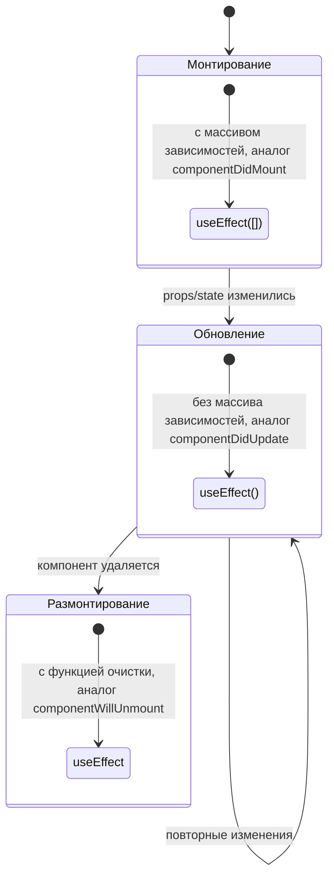

# Курс по веб-разработке

<h2 class="color-gray-400 fw-200">Введение в React. Сборщики</h2>

---
layout: two-cols
---

<style scoped>
  text {
    font-size: 12px;
  }
</style>

# React

Введение

<div class="mt-8">

> **React** - библиотека для разработки пользовательских интерфейсов, в основе которой лежим компонентный подход

<br />

> **Компонент** - это независимая часть интерфейса, которые можно переиспользовать (например: меню, поле ввода или форма)

<br />

> Отрисовку компонента - то есть, обновление интерфейса в соответствии с изменившимся состоянием приложения - называют **рендерингом**

</div>

::right::

<svg xmlns="http://www.w3.org/2000/svg" width="110%" viewBox="0 0 900 560" font-family="Segoe UI, Roboto, Arial" class="mt-25">
  <!-- Page outline -->
  <rect x="40" y="30" width="820" height="500" rx="8" ry="8" fill="white" stroke="#d1d7e6" stroke-width="2"/>

  <!-- Header (component) -->
  <g id="header">
    <rect x="60" y="48" width="780" height="70" rx="6" fill="#eef2ff" stroke="#c6d2ff"/>
    <text x="80" y="80" font-size="18" font-weight="700" fill="#2b3a67">Header</text>
    <text x="80" y="100" font-size="12" fill="#556080" font-style="italic">components/Header.jsx</text>
    <!-- logo and nav hint -->
    <rect x="690" y="62" width="120" height="36" rx="4" fill="#ffffff" stroke="#dbe3ff"/>
    <text x="706" y="86" font-size="12" fill="#3a4766">Login • Menu</text>
  </g>

  <!-- Left nav (component) -->
  <g id="nav">
    <rect x="60" y="138" width="170" height="300" rx="6" fill="#fffdf6" stroke="#ffe9b8"/>
    <text x="78" y="166" font-size="16" font-weight="700" fill="#6a4a00">SideNav</text>
    <text x="78" y="186" font-size="12" fill="#7b5b1b" font-style="italic">components/SideNav.jsx</text>
    <!-- items -->
    <g fill="#f7f3ea">
      <rect x="70" y="200" width="150" height="28" rx="4"/>
      <rect x="70" y="234" width="150" height="28" rx="4"/>
      <rect x="70" y="268" width="150" height="28" rx="4"/>
      <rect x="70" y="302" width="150" height="28" rx="4"/>
    </g>
  </g>

  <!-- Right sidebar (component) -->
  <g id="sidebar">
    <rect x="660" y="138" width="180" height="300" rx="6" fill="#f6fff6" stroke="#d7f0d8"/>
    <text x="682" y="166" font-size="16" font-weight="700" fill="#1b6931">Sidebar</text>
    <text x="682" y="186" font-size="12" fill="#256b3a" font-style="italic">components/Sidebar.jsx</text>
    <rect x="680" y="200" width="140" height="56" rx="6" fill="#ffffff" stroke="#e7f5ea"/>
    <text x="700" y="232" font-size="12" fill="#2f6b3f">User • Quick links</text>
  </g>

  <!-- Main content area (component) -->
  <g id="main">
    <rect x="250" y="138" width="390" height="300" rx="6" fill="#ffffff" stroke="#e3e7ee"/>
    <text x="270" y="166" font-size="16" font-weight="700" fill="#1f3a63">Main</text>
    <text x="270" y="186" font-size="12" fill="#3a4f74" font-style="italic">pages/Home.jsx</text>

    <!-- Article cards (repeated component) -->
    <g id="card1">
      <rect x="280" y="200" width="330" height="72" rx="6" fill="#fbfbff" stroke="#e9ecff"/>
      <text x="296" y="224" font-size="14" font-weight="600" fill="#2b3a67">ArticleCard</text>
      <text x="296" y="244" font-size="12" fill="#6b778f" font-style="italic">components/ArticleCard.jsx</text>
      <rect x="540" y="210" width="64" height="48" rx="4" fill="#e9eefc"/>
    </g>

    <g id="card2">
      <rect x="280" y="286" width="330" height="72" rx="6" fill="#fbfbff" stroke="#e9ecff"/>
      <text x="296" y="310" font-size="14" font-weight="600" fill="#2b3a67">ArticleCard</text>
      <text x="296" y="330" font-size="12" fill="#6b778f" font-style="italic">(re-used)</text>
      <rect x="540" y="296" width="64" height="48" rx="4" fill="#e9eefc"/>
    </g>
  </g>

  <!-- Footer (component) -->
  <g id="footer">
    <rect x="60" y="452" width="780" height="60" rx="6" fill="#fff7fb" stroke="#ffdfe8"/>
    <text x="78" y="480" font-size="14" font-weight="700" fill="#7a2b4a">Footer</text>
    <text x="78" y="500" font-size="12" fill="#8b4a61" font-style="italic">components/Footer.jsx</text>
  </g>
</svg>

---

# React

JSX

В react используется **JSX (JavaScript XML)** - синтаксическое расширение JavaScript, позволяющее описывать структуру интерфейса в виде HTML-подобного кода. Это позволяет использовать **декларативный подход** и делать код намного более читаемым. Файлы с ним должны иметь расширение `.jsx`

```jsx
function Menu() {
  return (
    <ul className="menu">
      <li>Главная</li>
      <li>Блог</li>
      <li>Об авторе</li>
    </ul>
  );
}
```

---

# React

Компоненты

- Компоненты являются основными "строительными блоками" интерфейса. Технически - это просто JS-функция, возвращающая JSX-элемент
  > JSX-элементом может быть обычный HTML-тэг, другой React-компонент или фрагмент (о них позже)
- Компоненты можно повторно использовать и вкладывать друг в друга (называется **композицией** и используется вместо более классического **наследования**)

```jsx
function Welcome({ name }) {
  return <h1>Привет, {name}!</h1>;
}

export default function App() {
  return (
    <div>
      <Welcome name="Иван" />
      <Welcome name="Александр" />
    </div>
  );
}
```

---

<style scoped>
  p:not(h1 + p) {
    font-size: 12px;
    line-height: 1.1rem;
  }

  div {
    --slidev-code-font-size: 9px;
    --slidev-code-line-height: 11px;
  }
</style>

# React

Транспиляция JSX

> **Транспиляция (transpilation)** - преобразование программы, написанной на одном языке программирования в качестве исходных данных, в **эквивалентный код другой версии этого языка** или в другой язык программирования того же уровня абстракции. Для транспиляции используется специальные виды компиляторов - **транспиляторы (transpilers)**

Для того, чтобы JSX заработал, его необходимо транспилировать в обычный JS. JSX-элементы превращаются просто в вызовы функции `React.createElement()`:

<div class="grid grid-cols-2 gap-12">

```jsx
function Welcome({ name }) {
  return <h2>Hello {name}</h2>
}

export default function App() {
  return (
    <div>
      <Welcome name="Ivan" />
      <Welcome name="Alexander" />
    </div>
  );
}
```

<div v-click="1">

```js
function Welcome({
  name
}) {
  return React.createElement("h2", null, "Hello ", name);
}
export default function App() {
  return React.createElement("div", null, 
    React.createElement(Welcome, {
      name: "Ivan"
    }), 
    React.createElement(Welcome, {
      name: "Alexander"
    })
  );
}
```

</div>

<Arrow v-click="1" v-bind="{ x1: '48%', y1: '65%', x2: '52%', y2: '65%', width: 1, color: '#facc15' }" />

</div>

> Стандартным инстрментом транспиляции JSX является **Babel**. Можно опробовать его в интерактивном режиме [прямо на сайте](https://babeljs.io/repl)

---

<style scoped>
  li, p:not(h1 + p) {
    font-size: 14px;
    line-height: 1.3rem;
    margin-top: 4px;
    margin-bottom: 4px;
  }

  div {
    --slidev-code-font-size: 10px;
    --slidev-code-line-height: 11px;
  }
</style>

# React

Props

> **Props (properties, пропы)** - это входные данные для компонента в React

- Позволяют передать данные из родительского компонента в дочерний для последующего использования
- Пропы предназначены только для чтения и не должны изменяться внутри компонента, который их использует
- Могут быть любыми типами данных

```jsx
// name и city - пропы этого компонента
function UserCard({ name, city }) {
  return (
    <div className="card">
      <h2>{name}</h2>
      <p>Город: {city}</p>
    </div>
  );
}

export default function App() {
  return (
    <>
      <UserCard name="Анна" city="Москва" />
      <UserCard name="Иван" city="Казань" />
    </>
  );
}
```

---

<style scoped>
  li, p:not(h1 + p) {
    font-size: 12px;
    line-height: 1.1rem;
    margin-top: 4px;
    margin-bottom: 4px;
  }

  div {
    --slidev-code-font-size: 10px;
    --slidev-code-line-height: 11px;
  }
</style>

# React

State

> Помимо пропов, получаемых извне, компонент также может иметь внутренние данные - **состояние (state)**

- Для создания какого-то состояния используется функция `useState`, принимающая значение по умолчанию (или функцию его возвращающую) и возвращающая массив из 2х элементов:
  1. Значение состояния
  2. Функция для обновления состояния
- Изменение состояния приводит к обновлению компонента
  > **Важно:** изменение обязательно должно производиться при помощи функции, а не изменением значения напрямую, иначе компонент не обновится

```jsx
import { useState } from "react";

function Counter() {
  const [count, setCount] = useState(0);

  return (
    <div>
      <p>Счётчик: {count}</p>
      <button onClick={() => setCount(count + 1)}>Увеличить</button>
    </div>
  );
}
```

---

# React

Условный рендеринг

В React можно отображать элементы в зависимости от условий

<div class="grid grid-cols-2 gap-2">

```jsx
function Notification({ message }) {
  return (
    <div>
      {message && <p>Новое сообщение: {message}</p>}
    </div>
  );
}
```

```jsx
function Greeting({ isLoggedIn }) {
  return (
    <div>
      {isLoggedIn ? (
        <h1>Добро пожаловать обратно!</h1>
      ) : (
        <h1>Пожалуйста, войдите</h1>
      )}
    </div>
  );
}
```

</div>

---

<style scoped>
  p:not(h1 + p) {
    font-size: 11px;
    line-height: 1rem;
    margin-top: 2px;
    margin-bottom: 2px;
  }

  div {
    --slidev-code-font-size: 10px;
    --slidev-code-line-height: 11px;
  }
</style>

# React

Списки

Для отображения множества одинаковых элементов используется метод массивов `map`

> Каждый элемент списка должен иметь проп `key` с уникальным значением - это ключ, использующийся react'ом для того, чтобы эффективно отслеживать, добавлять, удалять и обновлять их при рендере. При этом не следует использовать в качестве ключа индексы массива, так индекс будет меняться для одних и тех же элементов при изменении порядка (например, при вставке или удалении)

```jsx
function UserList({ users }) {
  return (
    <ul>
      {users.map(user => (
        <li key={user.id}>
          {user.name} - {user.age} лет
        </li>
      ))}
    </ul>
  );
}

export default function App() {
  const users = [
    { id: 1, name: 'Анна', age: 25 },
    { id: 2, name: 'Иван', age: 30 },
    { id: 3, name: 'Мария', age: 22 },
  ];

  return <UserList users={users} />;
}
```

---

<style scoped>
  p:not(h1 + p) {
    font-size: 11px;
    line-height: 1rem;
    margin-top: 2px;
    margin-bottom: 2px;
  }

  div {
    --slidev-code-font-size: 10px;
    --slidev-code-line-height: 11px;
  }
</style>

# React

Фрагменты

Каждый компонент должен возвращать единственный элемент (который в свою очередь может иметь сколько угодно дочерних). Но бывает, что нужно вернуть несколько элементов, не оборачивая их в HTML-тэг, для этого используются фрагменты, для которых не создаётся соответствующего узла в DOM - `<>...</>` (не может иметь свойств) или `<React.Fragment>...</React.Fragment>` (может иметь свойства, например `key`)

```jsx
function TableRow() {
  return (
    <>
      <td>Анна</td>
      <td>25</td>
      <td>Москва</td>
    </>
  );
}

export default function App() {
  return (
    <table>
      <tbody>
        <tr>
          <TableRow />
        </tr>
      </tbody>
    </table>
  );
}
```

---

<style scoped>
  p:not(h1 + p) {
    margin: 4px 0;
  }

  figcaption {
    font-size: 11px;
  }

  div.mermaid {
    width: fit-content;
    margin: 0 auto;
  }
</style>

# React

Жизненный цикл компонентов

<div class="grid grid-cols-3 gap-2">

<div class="grid-col-span-2">

Все компоненты существуют на основе одинакового жизненного цикла:
1. **Монтирование (mount)** - создание компонента и добавление его в DOM
2. **Обновление (update)** - ререндер (перерисовка) компонента
3. **Размонтирование (unmount)** - удаление компонента из DOM

<br />

Обновление (ререндеринг) компонента происходит, если:
- Обновились пропы компонента
- Обновилось состояние компонента
- При перерендере родителя

</div>

<div>



<figcaption>В качестве аналогов приведены <a href="https://react.dev/reference/react/Component">методы классовых компонентов</a> (устаревший вариант)</figcaption>

</div>

</div>

---

<style scoped>
  li {
    font-size: 12px;
    line-height: 1.2rem;
  }

  div {
    --slidev-code-font-size: 8px;
    --slidev-code-line-height: 10px;
  }
</style>

# React

Жизненный цикл и классовые компоненты - как было раньше?

<div class="grid grid-cols-2 gap-2">

<div>

```tsx
import React from "react";

export default class ExampleComponent extends React.Component {
  constructor(props) {
    super(props);
    this.state = { count: 0 };
  }

  // Вызывается сразу после первого рендера
  componentDidMount() {
    console.log("Компонент смонтирован");
  }

  // Вызывается после каждого обновления (setState, новые props)
  componentDidUpdate(prevProps, prevState) {
    console.log("Компонент обновился");
  }

  // Вызывается перед удалением компонента
  componentWillUnmount() {
    console.log("Компонент размонтирован");
  }

  // Метод отрисовки
  render() {
    return <div>
        <p>Счётчик: {this.state.count}</p>
        <button onClick={() => this.setState({ count: this.state.count + 1 })}>
          Увеличить
        </button>
      </div>
  }
}
```

</div>

<div>

### Методы жизненного цикла

- **constructor(props)** - инициализация компонента, установка state по умолчанию
- **static getDerivedStateFromProps(props, state)** - синхронизация state с props перед рендером
- **render()** - возвращает JSX, описывает UI
- **componentDidMount()** - вызывается после первого рендера
- **shouldComponentUpdate(nextProps, nextState)** - управление необходимостью повторного рендера
- **getSnapshotBeforeUpdate(prevProps, prevState)** - получение DOM-снимка перед обновлением
- **componentDidUpdate(prevProps, prevState, snapshot)** - вызывается после обновления каждого обновления (state или props)
- **componentWillUnmount()** - компонент размонтируется (удаляется из дерева)
- **static getDerivedStateFromError(error)** - обновление state при ошибке
- **componentDidCatch(error, info)** - обработка ошибок

</div>

</div>

---

<style scoped>
  li, p:not(h1 + p) {
    font-size: 12px;
    line-height: 1.2rem;
  }

  div {
    --slidev-code-font-size: 8px;
    --slidev-code-line-height: 10px;
  }
</style>

# React

Хуки

> В современном react для использования его возможностей внутри компонентов (например, для взаимодействия с состоянием компонента) используются специальные функции - хуки (hooks)

Есть набор готовых хуков:
- `useState`
- `useEffect`
- `useMemo`
- `useCallback`
- `useContext`
- `useRef`
- `useReducer`
- и другие

Но также можно писать свои, главное, чтобы они удовлетворяли следующим правилам:
- Хуки могут быть вызваны только внутри React-компонентов или других хуков
- Название должно начинаться с префикса `use`
- Вызов хуков должен происходить только на верхнем уровне компонента - не допускается условных вызовов и вызовов в цикле

В остальном хуки - это обычные функции

---

<style scoped>
  div {
    --slidev-code-font-size: 11px;
    --slidev-code-line-height: 12px;
  }
</style>

# React

Хуки - `useState()` 

```js
import { useState } from "react";

function Counter() {
  const [count, setCount] = useState(0);
  const [theme, setTheme] = useState(() => { localStorage.getItem('theme') })

  const handleToggleTheme = () => {
    setTheme((prevTheme) => {
      if (prevTheme === 'light') {
        return 'dark';
      }

      return 'light';
    })
  }

  return (
    <div>
      <p>Счётчик: {count}</p>
      <button onClick={() => setCount(count + 1)}>Увеличить</button>
      <button onClick={handleToggleTheme}>Переключить тему</button>
    </div>
  );
}
```

---

<style scoped>
  li {
    font-size: 12px;
    line-height: 1.2rem;
  }

  div {
    --slidev-code-font-size: 8px;
    --slidev-code-line-height: 10px;
  }
</style>

# React

Хуки - `useEffect`

> `useEffect` позволяте выполнять побочные эффекты (загрузка данных с сервера, таймеры, манипуляции с DOM) и работать с жизненном циклом компонента. Эффект (функция, переданная в `useEffect`) срабатывает только посред рендера компонента

```jsx
import React, { useState, useEffect } from "react";

function Timer() {
  const [count, setCount] = useState(0);

  useEffect(() => {
    const interval = setInterval(() => setCount(c => c + 1), 1000);
    return () => clearInterval(interval); // очистка таймера при размонтировании
  }, []);

  useEffect(() => {
    console.log('Счётчик изменился')
  }, [count])

  return <p>Счётчик: {count}</p>;
}
```

- Вторым параметром `useEffect` принимает массив зависимостей: 
  - Если он пустой, то эффект выполнится единственный раз после первого рендера 
  - Если не пустой, то эффект будет выполняться при изменении любого из значений массива
  - Если ничего не передано, то эффект будет выполнять после каждого рендера
- `useEffect` может очищать эффект при помощи возврата функции - она выполнится при размонтировании компонента

---

# React

<style scoped>
  h3 {
    font-weight: 700;
    font-size: 18px;
  }

  li {
    font-size: 16px;
    line-height: 1.4rem;
  }
</style>

Virtual DOM

Для производительности React работает не с DOM напрямую, а с его **легковесной виртуальной копией** - **Virtual DOM**

### Упрощённая версия алгоритма

- `diffing` - при каждом рендере создаётся новое виртуально дерево, которое сравнивается с предыдущим
- `reconciliation` - на основе изменений react обновляет только те части настоящего DOM-дерева, которые действительно изменились

### Преимущества

- Повышение производительности за счёт минимизации обновлений DOM
- Делает обновления предсказуемыми
- Обеспечивает мультиплатформенность, так как Virtual DOM можно связать не только с браузерным DOM, но и с любым другим представлением реального интерфейса (например, при помощи ровно того же Virtual DOM работает React Native - библиотека для разработки android-приложений на React)

---
src: ./_shared.md#5
class: table-dense
---

---
layout: cover
---

# React - демонстрация

Пишем вместе список дел. Или что-то другое?

---

<style scoped>
  h3 {
    font-weight: 700;
    font-size: 20px;
  }

  h4 {
    font-size: 16px;
  }

  li, p:not(h1 + p) {
    font-size: 14px;
    line-height: 1.2rem;
  }

  p {
    margin: 4px 0;
  }
</style>

# Практика

<div class="grid grid-cols-2 gap-2 mb-4">

<div class="bg-gray-200 dark:bg-gray-800 p-2 border-rd-4">

<h3 class="color-green-500">Попроще</h3>

Напишите простое приложение для рисования: на экране есть сетка из квадратов, при клике на любой из них он перекрашивается в какой-то цвет

#### Усложнения
- Добавьте возможность выбирать размер сетки
- Добавьте возможность выбирать цвет для рисования
- Сделайте так, чтобы рисовать можно было "непрерывно", то есть зажимая кнопку и водя ей по сетке

</div>

<div class="bg-gray-200 dark:bg-gray-800 p-2 border-rd-4">

<h3 class="color-red-500">Посложнее</h3>

Напишите приложения для поиска репозиториев


[GitHub API - Конечная точка для поиска репозиториев](https://docs.github.com/en/rest/search/search?apiVersion=2022-11-28#search-repositories)

</div>

</div>

> Для создания проекта можно использовать команду `yarn create vite`

---
src: ./_shared.md#1
---

---

# Дополнительные материалы

- [Roadmap.sh - React](https://roadmap.sh/react) - дорожная карта по изучению React
- [React.js.org - Жизненный цикл компонента](https://ru.react.js.org/docs/react-component.html#%D0%96%D0%B8%D0%B7%D0%BD%D0%B5%D0%BD%D0%BD%D1%8B%D0%B9-%D1%86%D0%B8%D0%BA%D0%BB-%D0%BA%D0%BE%D0%BC%D0%BF%D0%BE%D0%BD%D0%B5%D0%BD%D1%82%D0%B0) - классовые компоненты
- [Hack Frontend - Методы жизненного цикла компонента в React](https://www.hackfrontend.com/docs/react/component-lifecycle-methods-in-react) - функциональные компоненты
- [Hack Frontend - Правила использования хуков в React](https://www.hackfrontend.com/docs/react/rules-for-using-hooks-in-react)
- [Hack Frontend - Virtual DOM в React](https://www.hackfrontend.com/docs/react/virtual-dom)