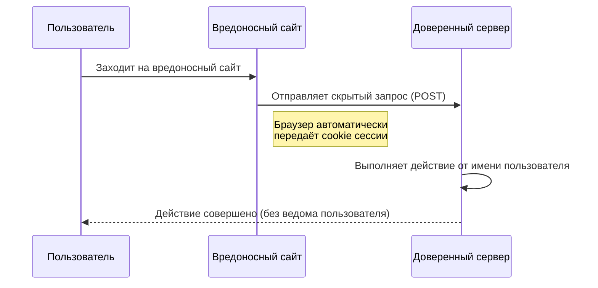
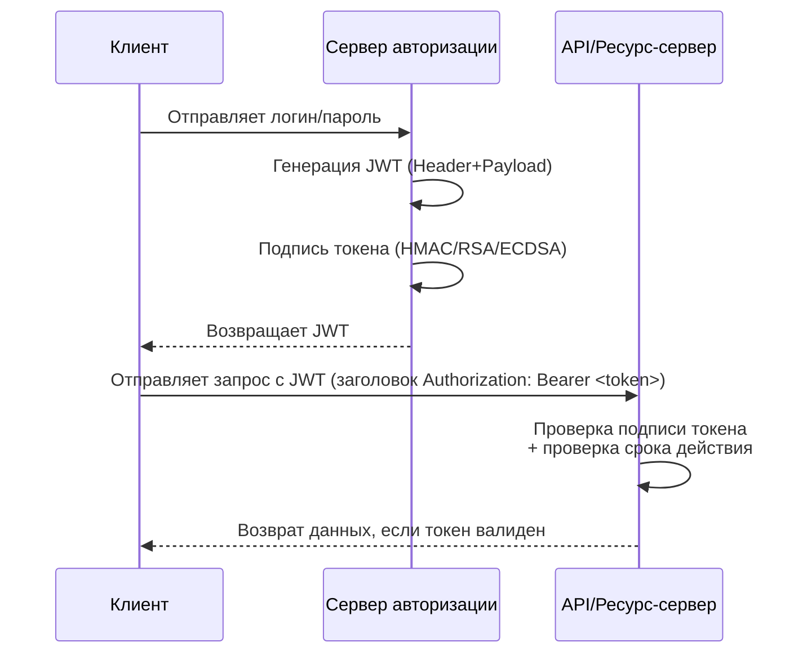

# Курс по веб-разработке

<h2 class="color-gray-400 fw-200">Авторизация</h2>

---

<style scoped>
  h3 {
    font-weight: 700;
    margin: 12px 0;
    font-size: 18px;
    line-height: 14px;
  }

  h3 + p {
    margin: 4px 0;
  }

  p, blockquote > p, blockquote li {
    font-size: 12px;
    line-height: 1.1rem;
  }
</style>

# Авторизация

### Регистрация
Создание новой учётной записи. Пользователь передаёт системе основные данные (логин, пароль, e-mail и др.), которые затем будут использоваться для **аутентификации**

### Идентификация
Процесс, при котором пользователь представляется системе, т.е. заявляет то, кем он является
> **Примеры**: форма логина (логин и пароль), поле `sub` в JWT-токене

### Аутентификация
Процесс процесс проверки личности пользователя. Система убеждается, что вы — это действительно вы.  

> **Примеры**: логин и пароль, JWT-токен, код из SMS или биометрия

### Авторизация
Предоставление пользователю определённых прав и уровней доступа после успешной аутентификации. Определяет, **что именно** пользователь может делать в системе. Например, пользователь может удалять только собственные посты в социальной сети

> **Шпаргалка:**
> - **Регистрация** - это "создай себя в системе"
> - **Идентификация** - это "покажи кто ты"
> - **Аутентификация** - это “докажи, что ты — это ты”
> - **Авторизация** - что тебе позволено

---

<style scoped>
  li {
    font-size: 16px;
    line-height: 1.5rem;
    margin-bottom: 8px;
  }
</style>

# Виды аутентификации

- **Простая аутентификация (Basic Auth)** - постоянная отправка пары логин/пароль вместе с запросом (заголовок `Authorization: Basic <usename>:<password>`, значение обычно кодируется в Base64)
- **Сессионная аутентификация (Session-based auth)** - в ней сервер хранит состояние пользовательской сессии
- **Аутентификация при помощи токена (Token-based auth)** - сервер каждый раз проверяет авторизационные данные, отправленные клиентом
- **SSO (Single Sign-on)** - механизм единого доступа к различным системам без необходимости повторного входа и с использованием одной учётной записи
- **OAuth 2** - специальный протокол, позволяющий получать пользовательские данные (например, читать письма с google-почти, если пользователь дал соответствующее соглашение) без передачи логина и пароля
- **OIDC (OpenID Connect)** - протокол-надстройка над OAuth 2, позволяющая авторизоваться в системе при помощи учётной записи в другой (например, vk или google)
    > Т.е. OAuth 2 отвечает за доступ к ресурсам (авторизацию), а OIDC - за установление личности пользователя (аутентификацию)

---

<style scoped>
  h3 {
    font-weight: 700;
    margin: 12px 0;
    font-size: 18px;
    line-height: 14px;
  }

  p, li {
    font-size: 16px;
    line-height: 1.3rem;
  }
</style>

# Stateful аутентификация

<div></div>

При входе пользователя сервер создаёт новую **сессию**, которую где-то постоянно хранит - в памяти, файле или БД. Клиент при каждом запросе отправляет её идентификатор, а сервер по ней определяет информацию о клиенте
- При входе создаётся сессия и сохраняется на сервере
- Клиент получает идентификатор сессии в качестве cookie, который отправляет в каждом запросе
- Сервер проверяет сессию и её актуальность

### Преимущества

- Сравнительна проста в реализации
- Безопастность, так как отправляемые авторизационные данные не содержат никаких чувствительных данных
- Гибкий контроль сессий, возможность их анулировать и контролировать срок жизни

### Недостатки

- Требует дополнительной памяти для хранения сессий и, потенциально, времени на их получение из БД
- Тяжело масштабируется, если требуется несколько экземпляров одного сервера

---
transition: none
---

<style scoped>
  h3 {
    font-weight: 700;
    margin: 12px 0;
    font-size: 18px;
    line-height: 14px;
  }
</style>

# Куки

> **Куки (Cookie)** - это небольшие текстовые данные в формате "ключ-значение", которые веб-сервер сохраняет в браузере пользователя (`document.cookie`) при помощи заголовка ответа `Set-Cookie`. Они передаются обратно на сервер при каждом запросе к соответствующему домену в заголовке `Cookie`

### Для чего используются
- **Хранение сессий** - идентификатор пользователя после входа
- **Настройки пользователя** - язык, тема, предпочтения
- **Персонализация контента**
- **Аналитика и статистика**
- **Таргетированная реклама**

---

<style scoped>
  p:not(h1 + p), li, blockquote {
    font-size: 14px;
    line-height: 1.4rem;
  }

  blockquote {
    margin: 8px 0;
  }
</style>

# Куки

Содержимое кук и атрибуты

- `Domain` / `Path` — область действия cookie, домен и конкретный путь соответственно
- `Expires` / `Max-Age` — срок жизни
- `HttpOnly` — запрет доступа из JS
- `Secure` — передача только по HTTPS
- `SameSite` — политика отправки куки для межсайтовых запросов
    - `Strict` - куки отправляются только на те сайты, которые им принадлежат
    - `Lax` - межсайтовая отправка куки допустима, если выполняются 2 условия: используется [безопасный метод](https://datatracker.ietf.org/doc/html/rfc7231#section-4.2.1), например `GET`, и осуществляется верхнеуровая навигация, то есть изменяется URL в браузере (например, пользователь нажимает на ссылку). Является значением по умолчанию для современных браузеров, но в старых браузерах может не поддерживаться в принципе
    - `None` - отключает ограничение для межсайтовых запросов, но только если утановлен `Secure`
- `<name>=<value>` — любые пары ключ и значение (кроме зарезервированных ключей)

> Куки имеют ограничение в 4 Кб данных для одного домена

```http
Set-Cookie: sessionId=123; Max-Age=120; Domain=example.com; Path=/api
```

---

# Stateful аутентификация

Пример

<div class="text-align-center mt-40">

**Базовый пример реалзиации располагается в <mark>[репозитории проекта](https://github.com/FloydanTheBeast/hse-lyceum-web-2025/tree/main/snippets/backend/auth/session)</mark>**

</div>

---
transition: none
---

<style scoped>
  h3 {
    font-weight: 700;
    margin: 12px 0;
    font-size: 18px;
    line-height: 14px;
  }

  p, li {
    font-size: 16px;
    line-height: 1.3rem;
  }
</style>

# Атака CSRF

> **Межсайтовая подделка запроса (CSRF/XSRF)** - атака, при которой злоумышленник заставляет браузер выполн​ить нежелательный запрос к доверенному сайту **от имени авторизованного пользователя**, используя автоматически передаваемые cookie (например, cookie сессии)

### Как предотвратить

- **SameSite Cookie**
  - `SameSite=Lax` — защищает от большинства кросс-сайтовых POST-запросов
  - `SameSite=Strict` — максимальная защита, cookie отправляется только при прямом переходе
  - Использовать вместе с `Secure` и `HttpOnly`

- **CSRF-токены**
  - Генерируются сервером и вставляются в формы/запросы
  - Проверяются при выполнении действий, требующих защиты

- **Double Submit Cookie**
  - Клиент отправляет CSRF-токен и через cookie, и через тело запроса
  - Сервер сравнивает значения

---

# Атака CSRF



---

<style scoped>
  h3 {
    font-weight: 700;
    margin: 12px 0;
    font-size: 18px;
    line-height: 14px;
  }

  p, blockquote > p, li {
    font-size: 14px;
    line-height: 1.2rem;
  }

  blockquote {
    margin-bottom: 4px;
  }
</style>


# Stateless аутентификация

> Подход, при котором сервер **не хранит состояние сессии**. Вся необходимая информация о пользователе передаётся клиентом в каждом запросе - обычно в виде **JWT (JSON Web Token)** или другого подписанного токена.

> **Токен** - это просто строка-идентификатор, которая подтверждает личность пользователя 

1. Пользователь проходит аутентификацию
2. Сервер выдает токен, содержащий закодированные данные (claims)
3. Клиент хранит токен (в памяти, cookie или localStorage)
4. В каждом запросе клиент отправляет токен, а сервер проверяет подпись
5. Сервер принимает решение **без обращения к сохранённой сессии**

###  Преимущества
- **Масштабируемость** - нет необходимости хранить сессии в памяти или БД
- **Нет состояния на сервере** - каждый экземпляр приложения может подтвердить токен
- **Высокая производительность** - проверка подписи работает быстро

### Недостатки
- **Нельзя принудительно завершить токен** (до истечения срока жизни),  
  если не использовать дополнительные механизмы (блэклисты, ротация токенов)
- **Потенциально большой размер токена**
- **Требует аккуратного хранения токена на клиенте** - для предотвращения кражи
- **Сложнее реализовать обновление токена** - нужно использовать refresh-токены

---
transition: none
---

<style scoped>
  h3 {
    font-weight: 700;
    margin: 12px 0;
    font-size: 18px;
    line-height: 14px;
  }

  li {
    font-size: 16px;
    line-height: 1.5rem;
  }

  blockquote {
    margin-bottom: 4px;
  }
</style>

# JWT

> **JWT (JSON Web Token)** — это JSON объект, который определен в открытом стандарте [RFC 7519](https://www.ietf.org/rfc/rfc7519.txt). Он считается одним из безопасных способов передачи информации между двумя участниками
>
> Простыми словами - это лишь строка в формате `header.payload.signature`

### Структура

- **Header** — содержит информацию о том, как должна вычисляться подпись
    > `header = { "alg": "HS256", "typ": "JWT"}`, поле `alg` - **алгоритм шифрования**
- **Payload** — полезные данные (id пользователя, роли, срок действия и т.д.), также называющиеся JWT-claims (заявки). Список стандартных заявок:
    - `iss` (issuer) - определяет приложение, из которого отправляется токен
    - `sub` (subject) - определяет, к кому относится токен
    - `exp` (expiration time) - время жизни токена
    - и другие
- **Signature** — подпись, защищающая от подделки и гарантирующая:
    - **Целостность** - содержимое токена не изменено
    - **Подлинность** - токен действительно создан доверенным сервером

---
transition: none
---

<style scoped>
  h3 {
    font-weight: 700;
    margin: 12px 0;
    font-size: 18px;
    line-height: 14px;
  }

  
  li, p {
    font-size: 12px;
    line-height: 1.1rem;
    margin-bottom: 8px;
  }
</style>

# JWT

```js
const SECRET_KEY = 'cAtwa1kkEy'
const unsignedToken = base64urlEncode(header) + '.' + base64urlEncode(payload)
const signature = HMAC_SHA256(unsignedToken, SECRET_KEY)

const jwtToken = encodeBase64Url(header) + '.' + encodeBase64Url(payload) + '.' + encodeBase64Url(signature)
```

<figcaption>Псевдокод генерации JWT-токена</figcaption>

<br />

> Обратите внимание, что все части JWT-токена кодируются в формат **base64**, но без отступов (символов `=` или `==`)

### Алгоритм проверки подписи сервером

1. Отделяет и декодирует `header` и `payload`, полученный от клиента
2. Вычисляет подпись заново по тому же алгоритму
3. Сравнивает полученную подпись с подписью из токена
    > Если подписи не совпадает, то токен считается подделанным и пользователю запрещается доступ к ресурсу

> **Важно:** JWT не шифрует данные, передаваемые в payload, а только кодирует. Это значит, что никакой гарантии безопаности для чувствительных данных нет
>
> Также важно выбирать сложный секретный ключ и алгоритм шифрования, подходящий под ваши задачи. Подробнее об этом возможно речь пойдёт позже

---
transition: none
---

<style scoped>
  div.mermaid {
    width: fit-content;
    margin: 10px auto 0;
  }
</style>

# JWT



---

<style scoped>
  h3 {
    font-weight: 700;
    margin: 12px 0;
    font-size: 18px;
    line-height: 14px;
  }

  p:not(h1 + p), li {
    font-size: 16px;
    line-height: 1.3rem;
  }
</style>

# JWT

Refresh Token

> Обычно JWT-токен имеет довольно короткий срок жизни. Для того, чтобы не заставлять пользователя постоянно перезаходить в приложение используется токен с более долгим сроком жизни - **Refresh Token**. Обычный JWT в такой связке называют **Access Token**'ом (токеном доступа)

### Как работает

1. Пользователь логинится → сервер выдаёт **JWT + Refresh Token**
2. Клиент использует **JWT** для запросов
3. JWT истёк → клиент отправляет **Refresh Token** на специальный путь  
4. Сервер проверяет **Refresh Token** по аналогии с Access → выдаёт новую пару
5. При компрометации **Refresh Token** можно **отозвать**

### Хранение
- На клиенте обычно хранится в **HttpOnly cookie** или в `localStorage`
- На сервере может быть **stateful** (т.е. храниться в памяти или базе) для возможности отзыва

### Зачем нужен
- Позволяет не заставлять пользователя часто логиниться
- Усиливает безопасность: короткий JWT снижает риск долгого компрометационного окна

---

# JWT

Пример

<div class="text-align-center mt-40">

**Базовый пример реалзиации JWT Access + Refresh располагается в <mark>[репозитории проекта](https://github.com/FloydanTheBeast/hse-lyceum-web-2025/tree/main/snippets/backend/auth/jwt)</mark>**

</div>

---

<style scoped>
  p:not(h1 + p), li, blockquote {
    font-size: 13px;
    line-height: 1.2rem;
  }

  .grid-cols-2 p {
    margin: 4px 0;
  }

  blockquote {
    margin: 8px 0;
  }
</style>

# Хранение паролей в БД

> Пароли в базе данных **никогда нельзя хранить в чистом виде**! Обычно в базе хранятся захэшированные версии паролей

> **Хэширование** — это процесс преобразования данных любого размера и типа (текста, чисел, файлов) в строку фиксированной длины, которая называется хэшем. Этот процесс выполняется с помощью специальной математической функции — **хэш-функции**

<div class="grid grid-cols-2 gap-2">

<div>

То есть, перед тем как сохранить пароль в БД, к нему следует применить функцию хэширования. Хорошо подходящие функции:
- **bcrypt**  
- **scrypt**  
- **PBKDF2**  
- **Argon2** - лучший современный выбор

> Вдобавок, помимо самого паролем, к хэшу обычно добавляется случайная строка - соль (salt). Итого в базе данных должно храниться `hashed_password = hash_fn(password + salt)`
> 
> Такой подход позволяет защитить аккаунты пользователей при несанкционированном доступе к базе данных, так как взломщики не смогут получить сами пароли

</div>


</div>

---

<style scoped>
  li {
    font-size: 12px;
    line-height: 1.2rem;
  }

  blockquote {
    margin-top: 8px;
  }
</style>

# Практика

> Реализуйте заметочный сервис с авторизацией (сесинной или при помощи JWT-токенов)

<div class="grid grid-cols-2 gap-2">

<div>

- Обработчики запросов:
    - `POST /register` - регистрация нового пользователя
    - `POST /login` - аутентификация пользователя
    - `GET /notes` - получение всех заметок текущего авторизованного пользователя
    - `POST /notes` - создание заметки для текущего авторизованного пользователя
    - `DELETE /notes/:id` - удаление 
    
    > Все обработчики, связанные с заметками, должны возвращать ошибку, если пользователь не авторизован
    >
    > При попытке удаления чужой заметки тоже должна возвращаться ошибка

</div>


</div>

---
src: ./_shared.md#1
---

---

# Дополнительные материалы

- [Habr - Коротко про виды авторизации](https://habr.com/ru/articles/939662/) - статья о видах аутентификации с примерами кода
- [Habr - Подробно про JWT](https://habr.com/ru/articles/842056/)
- [Habr - Методы защиты от CSRF-атаки](https://habr.com/ru/articles/318748/)
- [Habr - Как работает хэширование](https://habr.com/ru/companies/ruvds/articles/747084/)