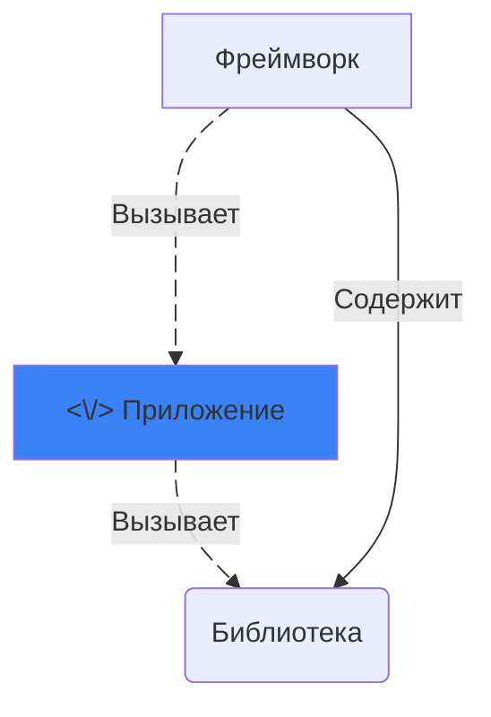

# Курс по веб-разработке

<h2 class="color-gray-400 fw-200">Бэкенд-фреймворки</h2>

---

<style scoped>
  div.grid-cols-2 p {
    margin-top: 0;
  }
</style>

# Фреймворки и библиотеки

<div class="mb-2">

> **Библиотека** - готовый программный код, предоставляющий некоторый набор функциональности и использующийся для ускорения процесса разработки. Примеры: `json`, `requests`, `numpy`, `axios` и т.п.

</div>

> **Фреймворк (англ. Framework — «каркас, структура»)** - такой же готовый программный код, но определяющий "каскад" вашей программы - архитектурный подход. Фреймворк обычно имеет некоторое поведение по умолчанию, а вы, как пользователь, его лишь расширяете. Примеры: `flask`, `django`, `FastAPI`, `React`, `Angular` и т.п.

<div class="grid grid-cols-2 gap-4 mt-4">

Но самый важный критерий различия - код библиотеки вызывается вами из программы, а в случае фреймворка наоборот - фреймворк вызывает написанный вами код. Это называется принципом <mark> **инверсии управления** </mark> (**Inversion of Control, IoC**).

<div class="mx-auto">

</div>

</div>

---
transition: none
---

<style scoped>
  td {
    font-size: 10px;
  }

  th {
    font-size: 12px;
  }

  h4 {
    margin-top: 4px;
  }
</style>

# Веб-фреймворки для Python

Сравнительный анализ

<div class="table-dense">

| Критерий | FastAPI | Django | Flask | aiohttp | Starlette |
|----------|---------|---------|---------|----------|-----------|
| **Тип фреймворка** | Полноценный ASGI | Полноценный WSGI | Микрофреймворк WSGI | Библиотека HTTP | ASGI-фреймворк |
| **Асинхронность** | ✅ Полная поддержка | ⚠️ Частичная (3.1+) | ❌ Нет | ✅ Полная поддержка | ✅ Полная поддержка |
| **Производительность** | ⭐️ Очень высокая | ⭐ Средняя | ⭐ Средняя | ⭐️️️️️️️️️️️️️️️️️️️️️️️️️️️️️️️ Очень высокая | ⭐️️️️️️️️️️️️️️️️️️️️️️️️️️️️️️️ Очень высокая |
| **Сложность изучения** | Средняя | Высокая | Низкая | Высокая | Высокая |
| **Встроенная админка** | ❌ Нет | ✅ Да | ❌ Нет | ❌ Нет | ❌ Нет |
| **ORM** | Поддержка сторонних | ✅ Встроенная | ❌ Нет | ❌ Нет | ❌ Нет |
| **Автодокументация** | ✅ Swagger/ReDoc | ❌ Нет | ❌ Нет | ❌ Нет | ❌ Нет |
| **Валидация данных** | ✅ Pydantic | ✅ Forms/Serializers | ❌ Сторонняя | ❌ Нет | ❌ Нет |
| **Размер кодовой базы** | Средний | Очень большой | Очень маленький | Маленький | Маленький |
| **Поддержка WebSocket** | ✅ Да | ✅ Да | ❌ Сторонняя | ✅ Да | ✅ Да |
| **Тестирование** | ✅ Простое | ✅ Простое | ✅ Простое | ⚠️ Среднее | ✅ Простое |
| **Сообщество** | Растущее | Очень большое | Очень большое | Среднее | Среднее |
| **Идеальное применение** | API, микросервисы | Монолиты, CMS | Простые приложения | Высокопроизводительные сервера | Базовый ASGI |

</div>

---
hideInToc: true
---

# Веб-фреймворки для Python

<style scoped>
  h4 {
    margin: 4px 0;
    font-size: 18px;
    line-height: 1.5rem;
  }

  li {
    font-size: 13px;
  }
</style>

Выводы из сравнительного анализа

### Для высокопроизводительных API
- **FastAPI** — лучший баланс функциональности и скорости
- **aiohttp** — максимальная производительность, но больше повторяющегося кода
- **Starlette** — основа для кастомных решений

### Для крупных серьёзныз проектов
- **Django** — готовое всё из коробки
- **FastAPI** — современная альтернатива для API

### Для простых проектов
- **Flask** — минимализм и простота
- **FastAPI** — если нужна асинхронность

### Для экстремальной производительности:
- **aiohttp** — минимальная надстройка над asyncio
- **Starlette** — более структурированный подход

<div class="mt-4">

> **Рекомендация:** FastAPI стал практически стандартом для серверных приложений благодаря сочетанию производительности, функциональности и простоты разработки, поэтому и изучаем конкретно его

</div>

---
routeAlias: decorators
---

<style scoped>
  li {
    font-size: 12px;
    line-height: 1.1rem;
  }
</style>

# Декораторы

> **Декоратор** - функция, "оборачивающая" другую функцию и каким-либо образом расширяющая или меняющая её поведение. Часто в языках есть спецальный синтаксис для оборачивания декораторами, хотя можно обойтись и без него

<div class="grid grid-cols-2 gap-4 mt-8">

```py
def trace(func):
    def wrapper(*args, **kwargs):
        print(f'[TRACE]: Вызов {func.__name__}() '
              f'с {args}, {kwargs}')

        original_result = func(*args, **kwargs)

        print(f'[TRACE]: {func.__name__}() '
              f'вернула {original_result!r}')

        return original_result
    return wrapper

@trace
def format_user_message(message, user):
  return f'<{user}> отправил сообщение: {message}'
```

<div>

```
>>> format_user_message("Привет, ученики", user="Шади")
[TRACE]: Вызов format_user_message() с ('Привет, ученики',), {'user': 'Шади'}
[TRACE]: format_user_message() вернула '<Шади> отправил сообщение: Привет, ученики'
'<Шади> отправил сообщение: Привет, ученики'
```

Использование:
- Валидация
- Логгирование (журналирование)
- Контроль доступа (авторизация на сервере)
- Кэширование результатов работы функции
- Ограничение скорости/количества выполнений
- и другое...

</div>

</div>


---

# FastAPI

> **FastAPI** - современный, быстрый (высокопроизводительный) веб-фреймворк для построения API при помощи Python с использованием стандартных аннотаций типов (*взято с сайта*). Основан на **спецификации ASGI** (ссылка на статью о ней в дополнительных материалах)

<h4 class="mt-4">Возможности</h4>

- Поддержка асинхронности и высокая производительность
- Автоматическая генерация документации (Swagger и ReDoc)
- Валидация данных на основе `Pydantic`
- Автоматическая сериализация в JSON
- Поддержка **инъекции зависимостей**
- Поддержка `HTTP/1.1`, `HTTP/2`, WebSocket и простая интеграция с GraphQL (при помощи расширения)
- Аутентификация "из коробки"
- и многое другое...

---
hideInToc: true
---

# FastAPI

Базовое приложение

<h5 class="mt-4">Подготовка</h5>

```sh
python -m venv fastapi-project
# "fastapi[standard]" включает набор опциональных зависимостей (шаблонизатор, валидация и т.п.)
pip install "fastapi[standard]"
```

##### Базовый код

```py
from fastapi import FastAPI

app = FastAPI()


@app.get("/")
async def root():
    return {"message": "Hello World"}

```

##### Запуск и тестирование

```sh
fastapi dev # Запуск сервера в dev-режиме (с автоматическим перезапускам при изменениях)
curl localhost:8000 # Тестовый запрос на сервер
```

---

<style scoped>
</style>

# FastAPI

Основы

<ul>
  <li><b>Обработчики запросов (ручки, хэндлеры, handlers)</b> - это основная составляющая приложения. Представляют собой функции, определяющие как отвечать на запрос к серверу по какому-то пути. Объявляются при помощи <Link to="decorators">декоратора</Link> <code>@app.[http-метод]('/some/path')</code></li>
  <li>Каждый обработчик связан с каким-то <b>путём (path)</b> - это часть URL после первого символа <code>/</code>. Пути также называют <b>конечными точками (endpoint)</b> или <b>маршрутами (route)</b></li>
  <li>FastAPI сильно полагается на аннотации, они используются для определения и преобразования типов, валидации данных и генерации документации</li>
  <li>FastAPI автоматически генерирует интерактивную документацию к вашему коду по стандарту <b>OpenAPI</b> (подробнее о ней позже)</li>

  <ul class="ml-10">
    <li>Интерфейс <b>Swagger</b> - по пути <code>http://localhost:8000/docs</code></li>
    <li>Интерфейс <b>Redoc</b> - по пути <code>http://localhost:8000/redoc</code></li>
  </ul>

</ul>

---

<style scoped>
  div {
    --slidev-code-font-size: 10px;
    --slidev-code-line-height: 14px;
  }


  h4 {
    font-size: 14px;
    line-height: 1.1rem;
    font-weight: 700;
  }

  p:not(h1 + p) {
    margin: 4px 0;
    font-size: 11px;
    line-height: 1rem;
  }
</style>

# FastAPI

Данные запроса

<div class="grid grid-cols-2 gap-4 mt-4">

<div v-click>

#### Ручная работа с запросом

Объект запроса можно получить, добавив функции-обработчику аргумент типа `Request`:

```py
from fastapi import Request

@app.get()
def root(request: Request)
  ...
```

</div>

<div v-click>

#### Параметры пути (Path Parameters)

Путь обработчика может содержать выражение вида `{some_param}` - это **параметры пути**. Они будут переданы в качестве аргументов функции-обработчику

```py
@app.get('/users/{id}')
async def get_user(id: int):
  ...
```

</div>

<div v-click>

#### Параметры запроса (Query Parameters)

Если у функции-обработчика есть параметры, названия которых не соответствуют параметрам пути, то они будут расценены как **параметры запроса**

```py
# localhost:8000/users?q=search&ids=[1,2,3]

@app.get('/users')
async def get_users(q: str, ids: list[int] | None):
  ...
```

</div>

<div v-click>

#### Тело запроса

Для получения тела запроса используются специальные классы-модели библиотеки `pydantic`

```py
from pydantic import BaseModel

class UserModel(BaseModel):
  name: str
  age: int | None
  ...

@app.post('/users/create')
async def create_user(user: UserModel):
  ...

```

</div>

</div>

---

<style scoped>
  p:not(h1 + p) {
    font-size: 12px;
    line-height: 1.1rem;
    margin: 4px 0;
  }
</style>

# FastAPI

Ответ сервера

Для ответа на запрос используется класс `Response` и его подклассы: `FileResponse`, `HTMLResponse`, `JSONResponse`, `ORJSONResponse`, `PlainTextResponse`, `RedirectResponse`, `Response`, `StreamingResponse`, `UJSONResponse`

По умолчанию, если вы явно не возвращаете класс `Response`, FastAPI сериализует ваши данные в `JSON` автоматически и вернёт экземпляр `JSONResponse`, установив соответствующие заголовки

<div class="grid grid-cols-2 gap-2">

```py
from fastapi import Response
from fastapi.responses import RedirectResponse,\
                              JSONResponse
from pydantic import BaseModel

# Неявный возврат JSON
@app.get(...)
async def root()
  return { 'key': 'val' }

# Явный возврат JSON
class UserModel(BaseModel):
  name: str

@app.get(...)
async def root(user: UserModel) -> UserModel
  return user
```

```py
# Ручной возврат HTML
@app.get(...)
async def page():
  return Response(content='<html>...</html>',
                  media_type="text/html")

# или

@app.get(...)
async def page(response: Response):
  response.headers['content-type'] = 'text/html'
  return '<html>...</html>'

# Перенаправление
@app.get(...)
async def redirect():
  return RedirectResponse('https://ya.ru')
```

</div>

---

# FastAPI

Валидация данных

> **Валидация** - процесс проверки входных данных на соответствие определённой необходимой структуре, типам данных и/или ограничениям, прежде чем использовать эти данные в бизнес-логике программы

FastAPI предлагает использовать специальную библиотеку для валидации - `pydantic`

```py {*}{maxHeight: '300px'}
from fastapi import FastAPI
from pydantic import (
    BaseModel,
    Field,
    EmailStr,
    field_validator,
    model_validator
)
from typing import List, Optional
from enum import Enum
from datetime import datetime

app = FastAPI()


class Role(str, Enum):
    user = "user"
    admin = "admin"


class Address(BaseModel):
    city: str = Field(min_length=2)
    street: str
    zip_code: str = Field(pattern=r"^\d{5}$")


class UserCreate(BaseModel):
    email: EmailStr
    password: str = Field(min_length=8)
    age: int = Field(ge=18, le=120)
    role: Role
    is_active: bool = True
    tags: List[str] = Field(min_length=1, max_length=5)
    address: Address
    created_at: Optional[datetime] = None

    # Пользовательская валидация кокретного поля
    @field_validator("password")
    @classmethod
    def validate_password(cls, v: str):
        if v.islower() or v.isalpha():
            raise ValueError("Пароль должен содержать буквы разного регистра или цифры")
        return v

    # Пользовательская валидация всей модели
    @model_validator(mode="after")
    def check_admin_age(self):
        if self.role == Role.admin and self.age < 21:
            raise ValueError("Администратор должен быть старше 21 года")
        return self


@app.post("/users")
def create_user(user: UserCreate):
    return user
```

---

# FastAPI

Обработка исключений

> **Обработка ошибок** - это механизм перехвата и преобразования исключений в контролируемые HTTP-ответы с понятной структурой и определёнными семантически верными кодовыми статусами HTTP

FastAPI предоставляет встроенные возможности для работы с ошибками:
- Класс **HTTPException** - базовое исключение для управления HTTP-ответом
- Класс **RequestValidationError** - ошибка валидации входных данных (статус 422)
- Автоматически сериализует объекты ошибок в JSON
- Позволяет объявлять функции для пользовательской обработки исключений

---

# FastAPI

Обработка исключений

```py {*}{maxHeight: '400px'}
from fastapi import Request
from fastapi.responses import JSONResponse
from fastapi.exceptions import RequestValidationError

# Регистрация функции для обработки исключений конкретного класса
# RequestValidationError - обрабатывается автоматически по умолчанию,
# но можно переопределить логику
@app.exception_handler(RequestValidationError)
async def validation_exception_handler(
    request: Request,
    exc: RequestValidationError
):
    return JSONResponse(
        status_code=422,
        content={
            "error": "validation_error",
            "details": exc.errors()
        }
    )

users = { 'the_teacher': 'Shadi Abdelsalam' }

@app.get("/users/{user_id}")
async def read_item(user_id: str):
    if user_id not in users:
        # FastAPI автоматически обработает такое исключение
        raise HTTPException(status_code=404, detail="User not found")
    return {"user": users[item_id]}
```

---

# FastAPI

Шаблоны и статика

<div class="grid grid-cols-2 gap-4">

<div>

<div class="mb-4">

> **Шаблоны (Templates)** - HTML-файлы с динамическим контентом, которые генерируются на сервере с использованием специальных библиотек - **шаблонизаторов (Template Engine)**, например - `Jinja2`. Используются для рендеринга веб-страниц.

> Шаблонизаторы обычно поддерживают дополнительные конструкции, не доступные в обычном HTML: условия, циклы, вызов функций и т.п.

</div>

> **Статика (статические файлы)** - неизменяемые файлы (CSS, JavaScript, изображения, шрифты и т.п.), которые обслуживаются сервером напрямую без необходимости обработки (т.е., вы, например, делаете запрос `/static/image.png` и получаете в ответ от сервера файл)

</div>

```py {7-11,13,18-20}
from fastapi import FastAPI, Request
from fastapi.responses import HTMLResponse
from fastapi.staticfiles import StaticFiles
from fastapi.templating import Jinja2Templates

app = FastAPI()

# По пути `/static/...` будут доступны все файлы
# в одноименной директории
app.mount("/static", StaticFiles(directory="static"),
          name="static")

templates = Jinja2Templates(directory="templates")


@app.get("/user/{id}", response_class=HTMLResponse)
async def user_page(request: Request, id: str):
    return templates.TemplateResponse(
        request=request, name="user.html",
        context={"id": id}
    )
```

</div>

---
transition: none
---

# Jinja

**Шаблонизатор** — это библиотека для генерации текстовых файлов на основе шаблона (чаще всего HTML) при помощи языка программирования

### Зачем?

- Отделение логики работы программы от представления (интерфейса)
- Динамическое отображение данных
- Переиспользование шаблонов
- Дополнительные возможности, упрощаующие генерацию разметки
  - Переменные
  - Условия
  - Циклы
  - Макросы (что-то вроде функций)
  - Фильтрация данных
  - Преобразование 
  - Автоматическое экранирование символов

---

# Jinja

Возможности

```html {*}{maxHeight: '400px'}
{# Комментарии #}

{# Переменные #}
<h1>Hello, {{ user.name }}!</h1>

{# Условия #}

  <p>Админ</p>

  <p>Обычный пользователь</p>


{# Циклы #}

  <li>{{ item }}</li>



{# Переиспользование шаблонов #}
<!-- base.html -->
<html>
  <body>
    
  </body>
</html>

<!-- page.html -->


  <h1>Page</h1>




  <button>{{ text }}</button>


{{ button("Нажми на меня!") }}



    This text becomes uppercase

```

---

<style scoped>
  li {
    font-size: 13px;
  }

  p {
    font-size: 14px;
    margin: 4px 0;
  }
</style>

# Практика

<style scoped>
  li, p {
    font-size: 12px;
    line-height: 1.2rem;
  }
</style>

<div class="grid grid-cols-2 gap-4">

<div>

### Декораторы

- Напишите декоратор `call_counter`, выводящий количество запусков функции и время выполнения
- Напишите декоратор `benchmark(iters: int)`, вызывающий функцию `iters` раз и выводящий среднее время выполнения
- Напишите декоратор, `retry(max_retries: int, delay: int)`, автоматически перезапускающий **асинхронную** функцию каждые `delay` секунд максимум `max_retries` раз в случае ошибки

<br />
<hr />
<br />

2. Напишите серверное приложение для приложения заметок, которое мы с вами делали ранее
- Те же дополнительные условия
- Данные можно хранить либо в памяти программы, либо в файле

</div>

<div>

### FastAPI

1. Напишите http-сервер со следующими endpoint'ами:

- `GET /uptime` - возвращает количество миллисекунд со старта сервера
- `GET /wiki?q=...` - перенаправляет на страницу поиска wikipedia с переданным запросом в качестве параметра запроса `q`
- `GET /anime/{id}` - возвращает JSON с названием и рейтингом аниме, полученного из внешнего api - `https://api.jikan.moe/v4/anime/{id}`
- `GET /page` - возвращает шаблонную html-страницу (любую), содержащую статический файл (тоже любой, можно css, можно картинку)
- `POST /create-log` - создаёт и записывает (дописывает если файл уже создан) в файл `logs.txt` время, заголовки и тело запроса

Дополнительные требования:
- Обязательно добавьте валидацию входных данных
- Создайте собственный обработчик ошибок валидации, сохраняющий информацию о запросе (например, ip-адрес и путь запроса) и ошибки в файл

</div>

<div>
</div>

</div>

---
src: ./_shared.md#1
---

---

# Дополнительные материалы

- [Skillbox Media - Знакомимся с FastAPI и пишем собственный API](https://skillbox.ru/media/code/znakomimsya-s-fastapi-i-pishem-sobstvennyy-api/)
- [FastAPI - Учебник - Руководство пользователя](https://fastapi.tiangolo.com/ru/tutorial/) - официальный туториал
- [Habr - Путь к пониманию декораторов в Python](https://habr.com/ru/companies/wunderfund/articles/657355/)
- [Jinja - Templates](https://jinja.palletsprojects.com/en/stable/templates/) - документация по синтаксису шаблонизатора Jinja
- [Selectel - Что такое ASGI - как работает и чем отличается от WSGI](https://selectel.ru/blog/what-is-asgl/)
