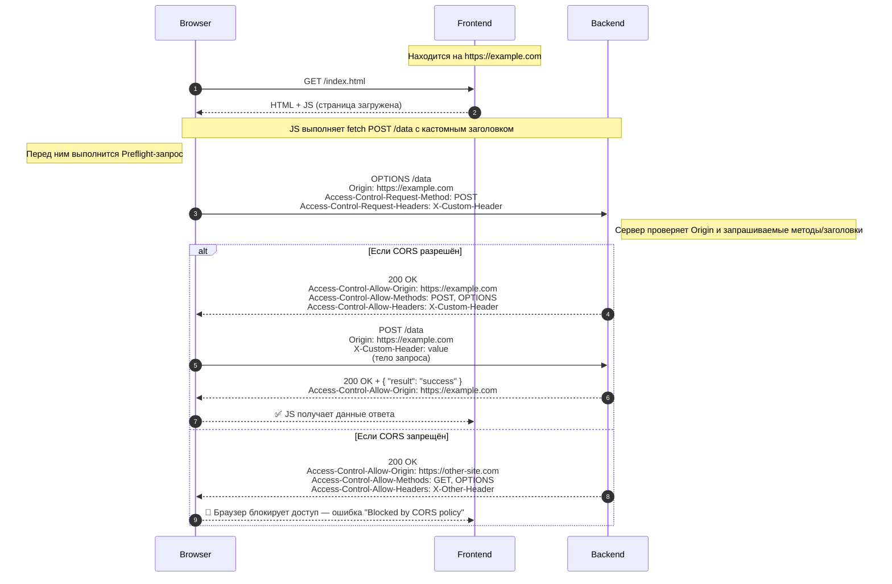

# Курс по веб-разработке

<h2 class="color-gray-400 fw-200">CORS. Документирование</h2>

---
layout: cover
---

# Вспоминаем фронтенд

---

# Практика по JS

<div class="grid grid-cols-2 gap-4">

<div>

### Задание 1
Напишите программу для мониторинга сайтов (которую мы уже писали ранее), только на JS (можно на node)
- Обязательно использовать классы
- Результаты можно выводить прямо на страницу (если делаете для браузера) или в файл (если делаете для node)

</div>

<div>

### Задание 2


</div>

</div>

---
transition: none
---

<style scoped>
  p, li {
    font-size: 16px;
    line-height: 1.4rem;
  }

  ul {
    margin-bottom: 10px;
  }
</style>

# CORS

> **CORS (Cross-Origin Resource Sharing)** - это **механизм безопасности браузеров**, который регулирует доступ веб-страниц к ресурсам из других источников

По умолчанию браузеры позволяют веб-страницам доступ только к ресурсам с того же **происхождения (origin)**, то есть с теми же схемой, доменом и портом

Для любого "сложного" запроса (либо метод, отличный от `GET`, `HEAD` или `POST`, либо нестандартные заголовки (обычно начинаются на `X-`)) браузер выполняет **preflight**-запрос - `OPTIONS` с заголовком `Origin` (происхождение или источник запроса, например `http://localhost:3000`). Сервер отвечает набором заголовков, по которым браузер понимает, можно ли осуществить реальный запрос

### Зачем нужен

- Защищает пользователей от несанкционированных запросов к сторонним сервисам из их браузера
- позволяет серверам явно разрешать доступ определённым сайтам или методам

> **Важно:** CORS не предотвращает сами запросы, а не даёт JS на чужом сайте получить данные ответа. Сервер всё равно должен защищать данные

---
transition: none
class: table-dense
---

<style scoped>
  td {
    font-size: 14px;
  }
</style>

# CORS

Заголовки

| Заголовок                            | Где используется  | Назначение                                                                        |
| ------------------------------------ | ----------------- | --------------------------------------------------------------------------------- |
| **Origin**                           | Запрос            | Указывает домен страницы, с которой сделан запрос.                                |
| **Access-Control-Allow-Origin**      | Ответ             | Определяет, каким источникам (доменам) разрешён доступ (`*`, конкретный домен).   |
| **Access-Control-Allow-Methods**     | Ответ (preflight) | Разрешённые HTTP-методы (`GET, POST, PUT...`).                                    |
| **Access-Control-Allow-Headers**     | Ответ (preflight) | Разрешённые заголовки запроса (например, `Content-Type`, `X-Custom`).             |
| **Access-Control-Allow-Credentials** | Ответ             | Разрешает или запрещает передачу куков/авторизации (`true`).                      |
| **Access-Control-Expose-Headers**    | Ответ             | Делаем доступными для JS определённые заголовки ответа (по умолчанию ограничено). |
| **Access-Control-Max-Age**           | Ответ (preflight) | Сколько секунд кэшировать результат preflight-запроса.                            |

---

<style scoped>
  div.mermaid {
    width: fit-content;
    margin: 0 auto;
  }
</style>

# CORS



---
layout: cover
---

# Документация

OpenAPI, JSDoc, Python docstrings

---

# Документация

Основы

<h3 class="fw-600">Зачем нужна</h3>

- Облегчает работу команды и понимание проекта
- Позволяет новым разработчикам быстрее вникнуть в новый проект
- Снижает вероятность ошибок при интеграции с другими сервисами
- При помощи некоторых инструментов позволяет автоматизировать тесты и генерацию кода

<h3 class="fw-600">Категории (условные)</h3>

- **Программная** — комментарии, JSDoc, Pythod docstrings
- **Техническая** — диаграмма архитктуры, схемы, API-документация
- **Пользовательская** — руководство по использованию
- **Проектная** - файлы `README.md` и `CONTRIBUTING.md` (правила работы с репозиторием), техническое задание

---

<style scoped>
  p, li {
    font-size: 16px;
    line-height: 1.4rem;
  }

  ul {
    margin-bottom: 10px;
  }
</style>

# OpenAPI

> **OpenAPI (ранее Swagger)** — это стандарт для описания **REST API** в формате JSON или YAML, который позволяет документировать, тестировать и автоматически генерировать клиентский код для взаимодействия с сервисом

<h3 class="fw-600">Зачем нужен</h3>

- Описание конечных точек, методы и параметры
- Описывать структуру запросов и ответов
- Автоматически генерировать документацию (Swagger UI, Redoc) и клиентский код

<h3 class="fw-600">Преимущества</h3>

- Единый стандарт для всех
- Уменьшает риск появления ошибок при интеграции с API
- Быстрая генерация документации и SDK

<h3 class="fw-600">Инструменты</h3>

- **Swagger**, **Redoc** - предоставляют интерактивную документацицию и инструменты для кодогенерации
- **Postman**, **Insomnia** - позволяют импортировать OpenAPI спецификацию
- Плагины для редакторов

---

# OpenAPI

<style scoped>
  div {
    --slidev-code-font-size: 10px;
    --slidev-code-line-height: 12px;
  }
</style>

Пример спецификации

<div class="grid grid-cols-5 gap-4">

<div class='col-span-3'>

```yml {*}{maxHeight:'400px'}
openapi: 3.0.3                                         # Версия OpenAPI
info:
  title: Пример API                                    # Название API
  version: 1.0.0                                       # Версия API
  description: Пример простого REST API для демонстрации OpenAPI  # Описание

servers:
  - url: https://api.example.com                       # Базовый URL сервера

paths:
  /users:                                              # Эндпоинт /users
    get:                                               # Метод GET
      summary: Метод для получения всех пользователей  # Краткое описание
      responses:
        '200':                                         # HTTP статус ответа
          description: Успешно
          content:
            application/json:
              schema:
                type: array
                items:
                  $ref: '#/components/schemas/User'  # Ссылка на модель User

components:
  schemas:
    User:                                            # Модель данных User
      type: object
      properties:
        id:
          type: integer
          example: 1
        name:
          type: string
          example: "Иван Иванов"
        email:
          type: string
          example: "ivan@example.com"
```

</div>

<div class="mx-auto col-span-2 p-2">
  
  <figcaption>Интерфейс Swagger. <a href="https://swagger.io/tools/swagger-editor/" target="_blank">Онлайн редактор</a></figcaption>
</div>

</div>

---

# OpenAPI

В FastAPI

- Автоматическая генерация OpenAPI спецификации для всех конечных точек
- Типизация Python (аннотации и pydantic модели) позволяет автоматически описывать структуру запросов и ответов
- Поддержка аутентификации и параметров (query, path, headers) в спецификации
- Позволяет тестировать API прямо из документации
- Может быть сконфигурирован и дополнен пользователем

<br/>

> Документация сразу доступна в браузере по следующим путям:
> - `/docs` — Swagger UI
> - `/redoc` — Redoc UI

---

# JSDoc

> **`JSDoc`** - язык для написания аннотаций для JavaScript кода и, по совместительству, генератор документации в HTML

<br />

```js twoslash
/**
 * Функция валидации объекта пользователя
 * @param {Object} options Объект пользователя
 * @param {string} options.name Имя пользователя
 * @param {string} options.email Email пользователя
 * @param {string} options.password Пароль
 * @param {boolean} [options.isAdmin=false] Флаг администратора
 * @throws {ValidationError} Выбрасывает ошибку валидации
 * @returns {true} `true`, если пользователь валиден
 * @see https://example.com
 */
function validateUser({ name, email, password, isAdmin = false }) { }
```

---

# Python Docstrings

> **Python Docstrings** - специальный формат докуменация для Python. Позволяет комментировать модули, классы и функции. Использует стиль написания `Sphinx` с синтаксисом облегченного языка разметки reStructuredText (reST)

<br />

```py
def validateUser(user):
    """Функция валидации объекта пользователя

    :param user: объект пользователя
    :type user: User
    :param user.name: имя пользователя
    :type user.name: str
    :param user.isAdmin: флаг администратора
    :type user.isAdmin: bool, optional

    :raises <ValidationError>: Ошибка валидации

    :rtype: <return_type>
    :return: <return_description>
    """
    pass
```

---
layout: cover
---

# Лайвкодинг

Что будем писать?

---
layout: cover
---

# Домашнее задание

Пишем фронтенд для нашего сервера

---
src: ./_shared.md#1
---

---

# Дополнительные материалы

## CORS
- [learn.javascript.ru - Fetch: запросы на другие сайты](https://learn.javascript.ru/fetch-crossorigin)

## OpenAPI

- [Habr - OpenAPI/Swagger для начинающих](https://habr.com/ru/articles/776538/)
- [Статья - How to generate an OpenAPI document with FastAPI](https://speakeasycom-git-ritza-add-exposing-api-publicly-speakeasyapi.vercel.app/openapi/frameworks/fastapi)

## Разное
- [Habr - Генерация документации с использованием JSDoc](https://habr.com/ru/articles/572968/)
