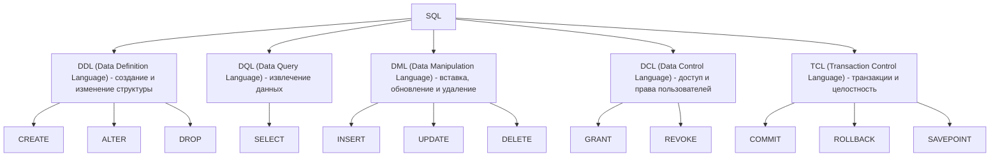
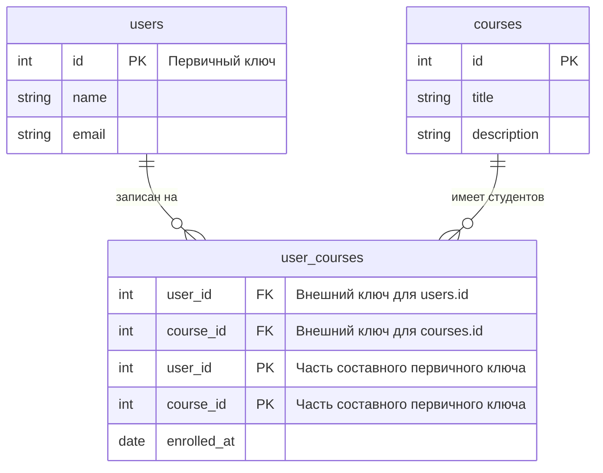

# Курс по веб-разработке

<h2 class="color-gray-400 fw-200">Качество кода.<br/>Введение в базы данных и SQL.</h2>

---
class: table-dense
---

<style scoped>
  th {
    font-size: 12px !important;
    padding: 4px 8px;
  }

  td {
    font-size: 10px;
  }
</style>

# Контроль качества кода

| Категория | Назначение | Примеры инструментов (Python и JS) |
|------------|----------------------|-----------------------|
| **Форматирование и стиль (Code Style)** | Приведение кода к единому стилю, автоформатирование, сортировка импортов | `Black`, `isort`, `autopep8`, `Prettier`, `YAPF` |
| **Линтинг (Linting)** | Проверка синтаксиса, ошибок, несоответствий стилю, "запахи" | `Flake8`, `Autoflake`, `Pylint`, `ESLint`, `Ruff` |
| **Статический анализ (Static Analysis)** | Анализ кода без выполнения: типы, безопасность, зависимости | `mypy`, `pyright`, `bandit`, `Semgrep`, `SonarQube` |
| **Динамический анализ (Dynamic Analysis)** | Анализ программы во время её выполнения: профилирование (замер производительности) и расчёт тестового покрытия | `cProfile`, `PySpy`, `coverage.py`, `Jest` |
| **Архитектурный линтинг (Architectural Linting)** | Проверка структуры проекта (например, допустимость импортов из определённых модулей или пакетов) | `import-linter`, `ArchUnit`, `Deptrac`, `Pydeps` |
| **Тестирование (Testing)** | Проверка корректности работы функций, модулей и системы | `pytest`, `unittest`, `Hypothesis`, `Cypress`, `JUnit` |
| **Документирование (Documentation)** | Проверка docstring-ов, генерация и валидация API-документации | `Swagger`, `Redoc`, `Sphinx`, `MkDocs`, `pydocstyle` |
| **Code Review** | Экспертная оценка кода, автоматизация комментариев в PR | Чек-листы стандартных проверок, `reviewdog`, `Danger`, `Gerrit` |
| **CI/CD и автоматизация (Automation)** | Автоматический запуск проверок при коммитах и сборках и генерация отчётов | `pre-commit`, `GitHub Actions`, `GitLab CI`, `Jenkins` |
| **Безопасность и аудит (Security & Auditing)** | Поиск нарушений безопасности в коде (недопустимые конструкции вроде `eval` или наличие конфиденциальных данных) и внешних зависимостях | `bandit`, `pip-audit`, `safety`, `Snyk`, `Semgrep` |

---

# Форматировщики

- `black` - не требует конфигурации, автоматически форматирует код по стандарту [PEP 8](https://peps.python.org/pep-0008/). Подходит для простых проектов
- `yapf`,`autopep8` - более гибкие, могут конфигурироваться
- `ruff` - очень гибкий и быстрый форматировщик и линтер в одном лице

<br />

> Так же есть некоторые инструменты для более специфичных целей, например для сортировки или удаления неиспользуемых импортов. На слайде с дополнительными материалами есть ссылка на список форматировщиков

---

# Линтеры и статические анализаторы

- `Flake8` - классический и проверенный линтер, расширяем при помощи плагинов
- `Pylint` - тоже классический вариант, очень гибкий и конфигурируемый, но при этом (мнение автора) излишне строгий по умолчанию и слишком многословный
- `MyPy` - для проврки типов (аннотаций), хорошо сочетается с другими инструментами
- `ruff` - опять же очень производительный, современный и гибкий. Сочетает в себе правила из множества других инструментов (`flake8`, `isort`, `pylint`, `pycodestyle` и другие)
- `Bandit` - специфичный инструмент для поиска уязвимостей в вашем коде

<br />

> Для многих инструментов есть расширения для различных сред разработки (например, [VS Code - Ruff](https://marketplace.visualstudio.com/items?itemName=charliermarsh.ruff)), найти их можно в соответствующей документации

<br />

> Более подробный список так же есть на слайде с дополнительными материалами

---

<style scoped>
  h3 {
    font-weight: 700;
  }

  p, li {
    font-size: 14px;
    line-height: 1.2rem;
  }

  div {
    --slidev-code-font-size: 8px;
    --slidev-code-line-height: 10px;
  }
</style>

# Git-хуки

> **Git-хуки (Git Hooks)** - специальные скрипты, которые автоматически выполняются при определённых событиях в Git (например, коммит, пуш или слияние)

<div class="grid grid-cols-2 gap-2"> 

<div>

### Для чего нужны
- Автоматически запуск форматировщиков и/или линтеров перед комитом, чтобы "плохой" код не попадал в репозиторий
- Проверка или автоматическая генерация сообщений коммита
- Автоматическаое обновление документации, версии проекта или файла `changelog` (содержит список изменений)

**Хуки** - любые исполняемые файлы (имеющие права на исполнение - `+x`). Они должны храниться в директории `.git/hooks` и иметь строго определённые имена (`pre-commit`, 'pre-push' и т.п.). Их можно писать вручную, а можно воспользоваться готовым инструментом, например `pre-commit` (`pip install pre-commit`)

</div>
<div>

Пример конфигурации `pre-commit` (файл `.pre-commit-config.yaml`):

```yaml
repos:
  - repo: https://github.com/pre-commit/pre-commit-hooks # Репозиторий с хуками
    rev: v3.2.0
    hooks:
      - id: trailing-whitespace
      - id: end-of-file-fixer
      - id: check-yaml
  - repo: local # Локальный репозиторий
    hooks:
      # Уникальный идентификатор
      - id: ruff
        # Название, которое будет выводиться в консоль
        name: Check with Ruff
        # Команда для запуска
        entry: uv run ruff
        # Язык
        language: system
        # Нужно ли передавать названия файлов в качестве аргументов командной строки
        pass_filenames: false
        always_run: true 
        # Дополнительные аргументы командной строки
        args: ["check", "project_name", "tests", "--fix"]
      - id: custom-script
        name: Custom script that does nothing
        entry: ./scripts/script.sh
        language: script
```

</div>

</div>

---

<style scoped>
  p, li {
    font-size: 16px;
    line-height: 1.4rem;
  }
</style>


# Conventional Commits

> **Conventional Commits** - простая спецификация по формированию сообщений git-коммитов

```
<тип>(<?раздел изменений>): <описание>

<?тело сообщения>

<?нижний колонтитул>
```

- **Тип** - стандартно либо `feat` для новых возможностей (от слова feature), либо `fix` для правок. Другие возможные значения: `build`, `chore`, `ci`, `docs`, `refactor`, `perf`, `test`
- **Раздел изменений (Scope)** - часть проекта, которая изменилась
- **Тело и нижний колонтитул** - необязательные части, содержащие более подробную информацию о коммите

<br />

```
feat(frontend): Добавлена страница авторизации
```

```
chore!: Убрана поддержка Python 2

BREAKING CHANGE: Использована функциональность Python версии 3
```

Символ `!` означает, что коммит содержит критические изменения


---
transition: none
---

#  Файл `pyproject.toml`

### Что это такое
`pyproject.toml` — единый конфигурационный файл Python-проекта  
(введён стандартом [PEP 518](https://peps.python.org/pep-0518/) и [PEP 621](https://peps.python.org/pep-0621/))

### Для чего нужен
- Описание метаинформации о проекте (название, автор, версия и т.п.)
- Унифицировать **сборку, зависимости и настройки** проекта  
- Заменить множество файлов (`setup.py`, `setup.cfg`, `requirements.txt`, `ruff.toml` и другие) единственным
- Хранить **конфигурации инструментов** (Black, Ruff, Mypy, Pytest и др.)

---
class: table-dense
---

<style scoped>
  td {
    font-size: 12px;
  }

  div {
    --slidev-code-font-size: 10px;
    --slidev-code-line-height: 12px;
  }
</style>

#  Файл `pyproject.toml`

### Основные секции

| Раздел | Назначение |
|--------|-------------|
| `[build-system]` | Определяет способ сборки проекта (setuptools, hatch, poetry и т.п.) |
| `[project]` | Метаданные проекта: имя, версия, автор, зависимости |
| `[tool.*]` | Конфигурация внешних инструментов (Black, Ruff, Pytest, Mypy и др.) |


### Пример структуры

```toml
# `pyproject.toml`
[project]
name = "my_app"
version = "0.1.0"
dependencies = ["fastapi", "uvicorn"]

[build-system]
requires = ["setuptools", "wheel"]
build-backend = "setuptools.build_meta"

[tool.black]
line-length = 88

[tool.pytest.ini_options]
testpaths = ["tests"]
```

---

# Lock-файл

> **Lock-файл (`*.lock`)** - это зафиксированный список **точных версий** всех зависимостей проекта,  
включая их подзависимости и источники установки. Используется пакетными менеджерами, например: **uv**, **Poetry**, **PDM** и **pip-tools**

### Для чего нужен
- Гарантирует **повторяемость сборки** на всех машинах
- Обеспечивает **детерминированную установку** (одинаковое окружение у всех)

### Что содержит

- Названия и **точные версии пакетов**  
- Контрольные суммы (`sha256`) для верификации корректности установки
- Информация о платформе и Python-версии
- Источники зависимостей (`PyPI`, Git, локальные пути)

> Учитывайте, что различные пакетные менеджеры используют разный формат lock-файлов, так что не получится использовать сразу несколько менеджеров для одного проекта

---
layout: cover
---

# Базы данных и SQL

---

<style scoped>
  h3 {
    margin: 6px 0;
  }

  li {
    font-size: 18px;
    line-height: 1.5rem;
  }
</style>


# Базы данных

Основы

> **База данных** — это организованное хранилище данных в электронном виде, предназначенное для эффективного получения, поиска и манипуляций. Она позволяет системам работать с большими объёмами данных структурировано, надёжно и, если всё делать правильно, производительно

### Зачем нужны

- Для хранения и обработки данных в приложениях
- Для обеспечения целостности и согласованности информации
- Для одновременного доступа нескольких пользователей
- Для автоматизации процессов, зависящих от данных

### Основные компоненты
- **Данные** — информация, хранимая в БД
- **СУБД (система управления базами данных)** — программное обеспечение, управляющее хранением и доступом к данным, например: PostgreSQL, MySQL, MS SQL Server и другие
- **Запросы** — инструкции, с помощью которых пользователь или программа взаимодействуют с БД

---
class: table-dense
---

<style scoped>
  h3 {
    font-size: 14px;
    font-weight: 700;
    line-height: 1.1rem;
  }

  h4 {
    font-size: 12px;
    font-weight: 600;
    line-height: 1.1rem;
  }

  th {
    font-size: 11px !important;
    padding: 2px 8px;
  }

  td {
    font-size: 9px;
  }

  p {
    margin: 4px 0;
  }

  p, li {
    font-size: 9px;
    line-height: 0.9rem;
  }

  div.grid-cols-4 > div {
    padding: 12px;
  }
</style>

# Типы баз данных

<div class="grid grid-cols-4 gap-2">

<div class="bg-gray-200 dark:bg-gray-800 p-2 border-rd-4 col-span-2">

### Реляционные (SQL)

**Принцип:** данные хранятся в таблицах, связанных между собой **ключами**.
Используется язык запросов **SQL (Structured Query Language)**.

#### Характеристики:
- Строгая структура данных (таблицы, столбцы, типы)
- Поддержка транзакций (ACID)
- Обеспечение целостности и связности данных

#### Примеры
- PostgreSQL  
- MySQL  
- SQLite  
- Oracle Database  
- Microsoft SQL Server

</div>

<div class="bg-gray-200 dark:bg-gray-800 p-2 border-rd-4 col-span-2">

### Нереляционные (No-SQL)

**Принцип:** данные хранятся без жёсткой схемы, в разных форматах — документы, пары "ключ–значение", графы и т.д.  
Используются для гибких, масштабируемых систем

| Подтип | Формат хранения | Примеры |
|--------|-----------------|----------|
| **Документные** | JSON / BSON документы | MongoDB, CouchDB |
| **Ключ–значение** | Пары ключ–значение | Redis, Valkey |
| **Колонночные** | Данные организованы по столбцам | ClickHouse, Cassandra, Memcached |
| **Графовые** | Узлы и связи между ними | Neo4j, EdgeDB |

</div>

<div class="bg-gray-200 dark:bg-gray-800 p-2 border-rd-4">

### Временные (Time-Series)

**Принцип:** оптимизированы для хранения и анализа данных, изменяющихся во времени (временных рядов)

#### Примеры
- InfluxDB
- Prometheus

</div>

<div class="bg-gray-200 dark:bg-gray-800 p-2 border-rd-4">

### Иерархические

**Принцип:** данные организованы в виде **дерева**

#### Примеры
- IBM DBOMP
- InterSystems Cache

</div>

<div class="bg-gray-200 dark:bg-gray-800 p-2 border-rd-4">

### Сетевые

**Принцип:** данные организованы в виде **графа**, где каждая запись (узел) может иметь **множество связей (родителей и потомков)**, считаются устаревшими

В отличие от **графовых БД** имеют строгую структуру и жёсткие связи

#### Примеры
- IDS (Integrated Data Store) и IDS/2
- IMAGE/3000

</div>

<div class="bg-gray-200 dark:bg-gray-800 p-2 border-rd-4">

### Объекто-ориентированные

**Принцип:** данные хранятся в виде объектов, аналогично структурам в ООП. Используются в специфических проектах, где важно хранить сложные структуры напрямую

#### Примеры
- db4o  
- ObjectDB  
- ZODB

</div>

</div>

---

# Реляционная модель данных

<style scoped>
  li {
    font-size: 14px;
    line-height: 1.2rem;
  }

  table {
    margin-top: 12px;
    position: relative;
    border: 2px solid #999;
  }

  table:before {
    content: 'Отношение (таблица)';
    font-weight: 600;
    color: #999;
    display: block;
    position: absolute;
    bottom: -30px;
  }

  th:nth-child(2) {
    position: relative;
  }

  th:nth-child(2):after {
    content: '';
    display: block;
    position: absolute;
    top: -2px;
    left: -3px;
    width: 75px;
    height: calc(100% * 4);
    border: 2px solid #ef4444;
  }

  th:nth-child(2):before {
    content: 'Атрибут (столбец)';
    display: block;
    width: 200px;
    position: absolute;
    top: -30px;
    left: -50%;
    color: #ef4444;
  }

  tr {
    position: relative;
  }

  tr:nth-child(2) {
    border: 2px solid #22c55e;
    position: relative;
    width: 150px;
  }

  tbody:before {
    content: 'Кортеж (строка)';
    font-weight: 600;
    display: block;
    position: absolute;
    color: #22c55e;
    top: 110px;
    right: -160px;
  }
</style>

> **Модель данных (Data Model)** - это логическое представление структуры, организации и взаимосвязей данных. Модель не отражает то, что происходит с хранением данных на физическом уровне - за это ответственны конкретные СУБД. Примеры - реляционная, иерархическая, сетевая и т.п.

<br />

> **Реляционная модель данных (РМД, Relational Model)** - представление или способ организации данных в виде двухмерных таблиц. Изучающие её разделы математики - реляционная алгебра и теория множеств

<br />

<div class="grid grid-cols-4 gap-2">

<div class="grid-col-span-2">

### Основные определения

- Данные хранятся в двухмерных таблицах, называющихся **отношениями (relation)**
- **Строки таблицы** - отдельная запись, называющаяся **кортежем (tuple)**
- **Столбцы таблицы** - **атрибуты (atributes)** - характеристика или свойство какой-то сущности. Можно сказать что каждая строка - множество атрибутов конкретной записи или сущности. Каждый атрибут имеет строго определённый **тип данных**
- Множество всех значений, которое принимает конкретный атрибут, называется **доменом (domain)**

</div>

<div>

<table>
  <thead>
      <tr>
          <th>id</th>
          <th>name</th>
          <th>email</th>
      </tr>
  </thead>
  <tbody>
      <tr>
          <td>1</td>
          <td>Alice</td>
          <td>alice@example.com</td>
      </tr>
      <tr>
          <td>2</td>
          <td>Bob</td>
          <td>bob@example.com</td>
      </tr>
      <tr>
          <td>3</td>
          <td>Charlie</td>
          <td>charlie@mail.com</td>
      </tr>
  </tbody>
</table>

</div>

</div>

---
transition: none
---

# SQL

> **SQL (Structured Query Language, Структурированный язык запросов)** — это декларативный язык, используемый для работы с реляционными базами данных. Он позволяет **создавать, изменять, извлекать и управлять данными** в таблицах, не описывая пошаговые алгоритмы выполнения

<br />


<figcaption>Язык SQL делится на 5 подъязыков</figcaption>

---
class: table-dense
---

<style scoped>
  table {
    margin-bottom: 10px;
  }

  td {
    font-size: 14px;
  }
</style>

# SQL

Типы данных

| Категория | Примеры типов | Назначение |
|------------|----------------|-------------|
| **Числовые** | `INT`, `BIGINT`, `DECIMAL`, `NUMERIC`, `FLOAT`, `REAL` | Хранение целых и дробных чисел |
| **Текстовые** | `CHAR(n)`, `VARCHAR(n)`, `TEXT` | Хранение строк и текстов, `(n)` - максимальная длина |
| **Логические** | `BOOLEAN` | Значения `TRUE`, `FALSE`, `NULL` |
| **Дата и время** | `DATE`, `TIME`, `TIMESTAMP`, `INTERVAL` | Работа с датами и временем |
| **Двоичные** | `BYTEA`, `BLOB` | Хранение файлов, изображений, бинарных данных |
| **Идентификаторы** | `SERIAL`, `BIGSERIAL`, `UUID` | Уникальные ключи и идентификаторы записей |
| **Прочие (специфичные)** | `JSON`, `JSONB`, `ARRAY`, `XML` | Хранение структурированных данных и коллекций |

> В конкретных СУБД типы данных могут различаться, смотрите документацию

---
class: table-dense
---

# DDL

> Используется для **создания, изменения и удаления** объектов базы данных (таблиц, индексов, схем, представлений и ограничений), необходим для описания её структуры 

<br />

<div class="grid grid-cols-2 gap-4">

| Команда | Назначение |
|----------|-------------|
| `CREATE` | Создаёт объект базы данных (таблицу, индекс, схему и т. д.) |
| `ALTER` | Изменяет существующий объект |
| `DROP` | Удаляет объект из базы данных |
| `TRUNCATE` | Удаляет все записи таблицы, сохраняя её структуру |


```sql
-- Создание таблицы
CREATE TABLE users (
    id SERIAL PRIMARY KEY,
    name VARCHAR(100) NOT NULL,
    email VARCHAR(255) UNIQUE,
    created_at TIMESTAMP DEFAULT NOW()
);

-- Изменение структуры таблицы
ALTER TABLE users ADD COLUMN age INT;

-- Удаление таблицы
DROP TABLE users;
```

</div>

---
transition: none
---

# Ключи и связи таблиц

<style scoped>
  h3 {
    font-size: 13px;
    font-weight: 700;
    line-height: 1.1rem;
    margin-bottom: 4px;
  }

  p, li {
    font-size: 10px;
    line-height: 1rem;
  }

  div {
    --slidev-code-font-size: 9px;
    --slidev-code-line-height: 12px;
  }
</style>

> В реляционных базах данных таблицы могут быть связаны друг с другом посредством **ключей**, что позволяет представить сложные структуры данных в виде логически связанных сущностей

<div class="grid grid-cols-3 gap-2 mt-2">

<div class="bg-gray-200 dark:bg-gray-800 p-3 border-rd-4">

### Первичные ключи (Primary Keys)

> **Первичный ключ** - атрибут или набор атрибутов (столбец или несколько столбцов), использующийся для **уникальной идентификации записей** и **определения связей** между таблицами. Они также обеспечивают целостность данных и предотвращают дублирование

- Должны быть уникальными для каждой записи
- Не могут быть пустыми (null)
- Единственный для одной таблицы
- Должен быть изменяем (не обязательно, но крайне желательно)

```sql
CREATE TABLE users (
    -- Первичный ключ
    id SERIAL PRIMARY KEY,
    name VARCHAR(100),
    email VARCHAR(255) UNIQUE
);
```

</div>

<div class="bg-gray-200 dark:bg-gray-800 p-3 border-rd-4">

### Внешние ключи (Foreign Keys)

> **Внешний ключ** - атрибут или набор атрибутов (столбец или несколько столбцов), использующийся для ссылки на первичный ключ другой таблицы. **Устанавливает связь** (родительско-дочернюю) между двумя таблицами

- Гарантируют **cсылочную целостность (Referential Integrity)** - для каждого вторичного ключа существует значение с таким же первичным в родительской таблице
- Могут быть пустыми (null)
- Их может быть несколько для одной таблицы
- Типы первичного и внешнего ключей должны совпадать

```sql
CREATE TABLE orders (
    id SERIAL PRIMARY KEY,
    user_id SERIAL,
    order_date TIMESTAMP,
    -- Внешний ключ
    FOREIGN KEY (user_id) REFERENCES users(id)
);
```

</div>

<div class="bg-gray-200 dark:bg-gray-800 p-3 border-rd-4">

### Составные ключи (Composite Keys)

> **Составной ключ** - первичный ключ, состоящий из двух или более атрибутов. Используется, когда одного атрибута недостаточно для уникальной идентификации записи

Обладает тем же набором свойств, что и простой первичный ключ

```sql
CREATE TABLE user_orders (
  user_id SERIAL,
  order_id SERIAL,
  PRIMARY KEY (user_id, order_id)
);
```

> **P.S.**: пример искуственный, в таблице `orders` и так есть связь с пользователем

</div>

</div>

---
class: table-dense
---

<style scoped>
  h3 {
    margin: 12px 0;
  }
</style>

# Ключи и связи таблиц

| Вид связи | Описание | Пример |
|-----------|----------|--------|
| **Один к одному (one-to-one, 1:1)** | Каждая запись одной таблицы соответствует **одной записи** другой таблицы | Пользователь — Профиль |
| **Один ко многим (one-to-many, 1:N)** | Одна запись одной таблицы связана с **несколькими записями** другой таблицы | Категория — Товары |
| **Многие ко многим (many-to-many, M:N)** | Несколько записей одной таблицы связаны с **несколькими** другой таблицы | Студенты — Курсы |

### Способы реализации

- **Один к одному (1:1)** - уникальный (с ограничением `unique`) внешний ключ в дочерней таблице
- **Один ко многим (1:N)** - внешний ключ в дочерней таблице
- **Многие ко многим (M:N)** - промежуточная таблица (junction table) с двумя внешними ключами

---

<style scoped>
  div.mermaid {
    width: fit-content;
    margin: 10px auto 0;
  }
</style>

# ERD

> **ERD (Entity-Relationship Diagram)** — визуальное представление структуры базы данных. Показывает сущности (таблицы), атрибуты (поля таблиц) и связи между ними



---
src: ./_shared.md#1
---

---

# Дополнительные материалы

- [Refactoring Guru - Запахи кода](https://refactoringguru.cn/ru/refactoring/smells)
- [GitHub - Awesome Python Code Formatters](https://github.com/life4/awesome-python-code-formatters) - список форматировщиков для python
- [GitHub - Python Linters and Code Analysis tools curated list](https://github.com/vintasoftware/python-linters-and-code-analysis) - курируемый список python-инструментов для линтинга и статического анализа
- [Pre-commit Docs](https://pre-commit.com/)
- [Conventional Commits](https://www.conventionalcommits.org/en/v1.0.0/)

## Базы данных и SQL
- [SQLBolt](https://sqlbolt.com/) - интерактивный учебник по SQL (на английском)
- [Яндекс Cloud - Реляционные базы данных](https://yandex.cloud/ru/docs/glossary/relational-databases)
- [Яндекс Практикум - ER‑диаграммы](https://practicum.yandex.ru/blog/chto-takoe-er-diagramma/)
